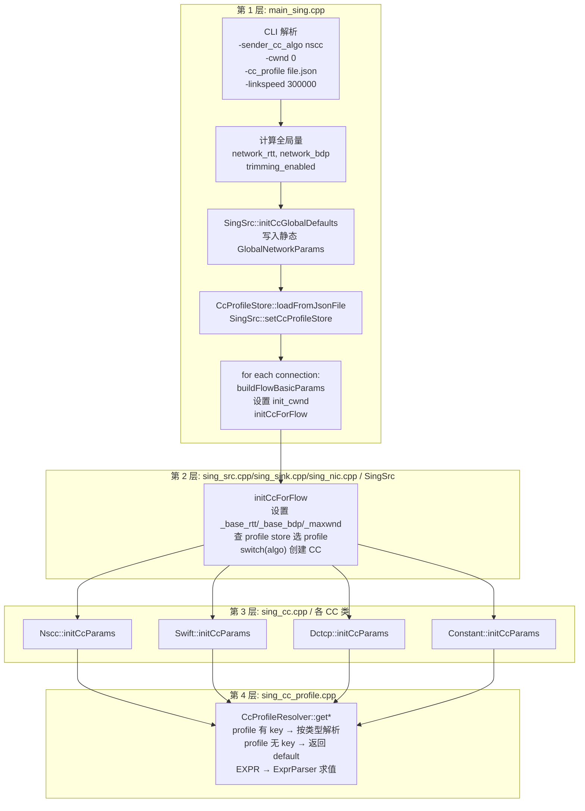

# CC 参数初始化全流程

> 2026-03 文件拆分说明：原 `sing.cpp/sing.h` 已拆分为 `sing_src.cpp|sing_sink.cpp|sing_nic.cpp` 与对应头文件，本文中的旧行号引用已改为稳定的函数名+文件名口径。

**版本**: v1.0
**日期**: 2026-03-01
**状态**: 与代码同步

---

## 1. 全局架构

CC 参数初始化分为 4 层，每层职责单一，数据单向向下流动：



一句话总结数据流向：

```
CLI 参数
  → GlobalNetworkParams (全局, 写入一次)
  + FlowBasicParams (每 flow, 含 init_cwnd)
  + CcProfile (可选, 从 JSON 文件)
  → initCcForFlow 分发
  → 各 CC.initCcParams(global, flow, profile) 用 Resolver 合并三者
  → CC 内部 Config + _cwnd 就绪
```

---

## 2. 三大数据结构

### 2.1 GlobalNetworkParams

网络级共享默认量，程序启动后写入一次，所有 flow 共享。

定义位置：`htsim/sim/sing_src.h/sing_sink.h/sing_nic.h`

| 字段 | 类型 | 含义 |
|------|------|------|
| `network_rtt_ps` | `simtime_picosec` | 网络级参考 RTT |
| `network_bdp_bytes` | `mem_b` | 网络级参考 BDP |
| `network_linkspeed_bps` | `linkspeed_bps` | 网络级参考速率 |
| `trimming_enabled` | `bool` | 是否启用 trimming |
| `default_mtu_bytes` | `mem_b` | 全局默认 MTU |
| `default_mss_bytes` | `mem_b` | 全局默认 MSS |

### 2.2 FlowBasicParams

每条 flow 的运行时上下文，在 `main_sing.cpp` 中构造完毕后传入 `initCcForFlow`。

定义位置：`htsim/sim/sing_src.h/sing_sink.h/sing_nic.h`

| 字段 | 类型 | 含义 | 赋值时机 |
|------|------|------|----------|
| `peer_rtt_ps` | `simtime_picosec` | 该 flow 的 RTT | `buildFlowBasicParams` |
| `bdp_bytes` | `mem_b` | 该 flow 的 BDP | `buildFlowBasicParams` |
| `nic_linkspeed_bps` | `linkspeed_bps` | 发送 NIC 的实际速率 | `buildFlowBasicParams` |
| `mtu_bytes` | `mem_b` | 该 flow 的 MTU | `buildFlowBasicParams` |
| `mss_bytes` | `mem_b` | 该 flow 的 MSS | `buildFlowBasicParams` |
| `init_cwnd` | `mem_b` | 初始窗口建议值 | main_sing 层直接赋值 |

`init_cwnd` 的计算规则：`(cwnd_from_cli == 0) ? 1.5 * bdp_bytes : cwnd_from_cli`。

### 2.3 CcProfile（可选）

从 JSON 文件加载的 CC 参数模板。未指定 `-cc_profile` 时为空（使用代码内置默认值）。

定义位置：`htsim/sim/sing_cc_profile.h`

```
CcProfile {
    id:     string              // profile 标识
    algo:   string              // 对应算法名 ("nscc" / "swift" / ...)
    params: map<string, CcProfileParam>  // 参数字典
}

CcProfileParam {
    kind:    NUMBER | BOOL | EXPR
    number:  double             // kind=NUMBER 时的值
    boolean: bool               // kind=BOOL 时的值
    expr:    string             // kind=EXPR 时的表达式
}
```

JSON 文件格式示例：

```json
{
  "cc": {
    "defaults": {
      "nscc": "nscc_default",
      "swift": "swift_default"
    },
    "profiles": {
      "nscc_default": {
        "algo": "nscc",
        "params": {
          "gamma": 0.8,
          "disable_quick_adapt": false,
          "max_cwnd": {"expr": "1.5 * bdp_bytes"}
        }
      }
    }
  }
}
```

---

## 3. 逐层详解

### 第 1 层：main_sing.cpp -- 准备所有输入

做三件事：

**A. 全局初始化**（建流循环之前，执行一次）

```cpp
// main_sing.cpp L814-826
bool trimming_enabled = !disable_trim;
mem_b network_bdp_bytes = static_cast<mem_b>(
    timeAsSec(network_max_unloaded_rtt) * (linkspeed / 8));
SingSrc::initCcGlobalDefaults(
    network_max_unloaded_rtt, network_bdp_bytes, linkspeed, trimming_enabled);

if (cc_profile_file != NULL) {
    auto cc_profile_store = std::make_shared<CcProfileStore>();
    std::string error;
    if (!cc_profile_store->loadFromJsonFile(cc_profile_file, &error)) { ... }
    SingSrc::setCcProfileStore(cc_profile_store);
}
```

**B. 循环建流**（对每条 connection）

```cpp
// main_sing.cpp L916-922
simtime_picosec flow_rtt = enable_accurate_base_rtt
    ? base_rtt_bw_two_points : network_max_unloaded_rtt;
mem_b flow_bdp_bytes = static_cast<mem_b>(
    timeAsSec(flow_rtt) * (nics.at(src)->linkspeed() / 8));
FlowBasicParams flow_basic_params =
    uec_src->buildFlowBasicParams(flow_rtt, flow_bdp_bytes);
flow_basic_params.init_cwnd = (cwnd_b == 0)
    ? static_cast<mem_b>(1.5 * flow_bdp_bytes)
    : cwnd_b;
uec_src->initCcForFlow(flow_basic_params);
```

`buildFlowBasicParams` 负责从 NIC 对象读取速率/MTU/MSS，打包成 `FlowBasicParams`。
`init_cwnd` 由 main 层根据 CLI `-cwnd` 参数直接赋值。

### 第 2 层：sing_src.cpp/sing_sink.cpp/sing_nic.cpp / SingSrc -- 纯分发

`initCcForFlow(const FlowBasicParams& params)` 的职责：

1. 设置连接级基础量（`_base_rtt`, `_base_bdp`, `_maxwnd`）
2. 从 `CcProfileStore` 查找当前算法的默认 profile（可能为空）
3. `switch(_sender_cc_algo)` 创建对应 CC 对象
4. 调用 `cc->initCcParams(global, params, profile)` -- **三个参数，无额外加工**

```cpp
// sing_src.cpp/sing_sink.cpp/sing_nic.cpp L111-168
void SingSrc::initCcForFlow(const FlowBasicParams& params) {
    _base_rtt = params.peer_rtt_ps;
    _base_bdp = params.bdp_bytes;
    _bdp = _base_bdp;
    setMaxWnd(1.5*_bdp);
    setConfiguredMaxWnd(1.5*_bdp);

    CcProfile selected_profile;
    if (_cc_profile_store) {
        auto profile = _cc_profile_store->findDefaultForAlgo(
            senderAlgoName(_sender_cc_algo));
        if (profile.has_value()) {
            if (profile->algo == senderAlgoName(_sender_cc_algo))
                selected_profile = *profile;
        }
    }

    // switch(_sender_cc_algo) 创建 CC 并调用 initCcParams
    // ...
}
```

### 第 3 层：sing_cc.cpp / 各 CC 类 -- 算法参数初始化

每个 CC 类实现 `initCcParams(global, params, profile)`：

- 对每个参数调用 `CcProfileResolver::get*(profile, key, default, global, params)`
- 含义：先查 profile 有没有该 key，有就用 profile 的值，没有就用 `default`
- 然后做算法特有的派生计算

示例（Nscc 的部分参数）：

```cpp
void Nscc::initCcParams(const GlobalNetworkParams& global,
                        const FlowBasicParams& params,
                        const CcProfile& profile) {
    _cfg.min_cwnd = CcProfileResolver::getMemB(
        profile, "min_cwnd", params.mtu_bytes, global, params);
    _cfg.max_cwnd = CcProfileResolver::getMemB(
        profile, "max_cwnd", static_cast<mem_b>(1.5 * params.bdp_bytes),
        global, params);
    // ...（scaling factor 计算、qa 参数等）
    _cwnd = CcProfileResolver::getMemB(
        profile, "init_cwnd", params.init_cwnd, global, params);
}
```

四个 CC 类当前解析的参数：

| CC 类 | 解析的参数 |
|-------|-----------|
| Nscc | `min_cwnd`, `max_cwnd`, `target_qdelay`, `gamma`, `delay_alpha`, `disable_quick_adapt`, `qa_gate`, `init_cwnd` |
| Swift | `min_cwnd`, `max_cwnd`, `init_cwnd`, `pkt_size`, `base_target_delay`, `ai`, `beta`, `max_mdf`, `rtx_reset_threshold`, `fs_min_cwnd`, `fs_max_cwnd` |
| Dctcp | `min_cwnd`, `init_cwnd`, `ai_unit` |
| Constant | `init_cwnd` |

### 第 4 层：sing_cc_profile.cpp / CcProfileResolver -- 参数解析

纯工具层，解析逻辑：

```
get*(profile, key, default_value, global, flow)
  └─ resolve(profile, key, global, flow)
       ├─ profile.params 中无 key → 返回 nullopt → 使用 default_value
       └─ profile.params 中有 key → 按类型处理：
            ├─ NUMBER → 直接返回数值
            ├─ BOOL   → 返回 1.0 / 0.0
            └─ EXPR   → resolveExpr(expr, global, flow) 表达式求值
```

提供 6 种类型转换方法：`getDouble`, `getMemB`, `getTimePs`, `getUint32`, `getUint8`, `getBool`。

---

## 4. 表达式变量表

当 profile 参数类型为 `EXPR` 时，`ExprParser` 可使用以下变量：

| 完整名 | 简写 | 来源 |
|--------|------|------|
| `flow.peer_rtt_ps` | `peer_rtt_ps` | `FlowBasicParams.peer_rtt_ps` |
| `flow.bdp_bytes` | `bdp_bytes` | `FlowBasicParams.bdp_bytes` |
| `flow.nic_linkspeed_bps` | `nic_linkspeed_bps` | `FlowBasicParams.nic_linkspeed_bps` |
| `flow.mtu_bytes` | `mtu_bytes` | `FlowBasicParams.mtu_bytes` |
| `flow.mss_bytes` | `mss_bytes` | `FlowBasicParams.mss_bytes` |
| `flow.init_cwnd` | `init_cwnd` | `FlowBasicParams.init_cwnd` |
| `global.network_rtt_ps` | `network_rtt_ps` | `GlobalNetworkParams.network_rtt_ps` |
| `global.network_bdp_bytes` | `network_bdp_bytes` | `GlobalNetworkParams.network_bdp_bytes` |
| `global.network_linkspeed_bps` | `network_linkspeed_bps` | `GlobalNetworkParams.network_linkspeed_bps` |
| `global.trimming_enabled` | -- | `GlobalNetworkParams.trimming_enabled` (1.0/0.0) |

表达式支持 `+`, `-`, `*`, `/`, 括号，一元正负号。

示例：`"max_cwnd": {"expr": "1.5 * bdp_bytes"}`

---

## 5. 文件清单

| 文件 | 职责 |
|------|------|
| `htsim/sim/datacenter/main_sing.cpp` | 第 1 层：CLI 解析、全局初始化、profile 加载、构造 FlowBasicParams、调用 initCcForFlow |
| `htsim/sim/sing_src.h/sing_sink.h/sing_nic.h` | 定义 `GlobalNetworkParams`、`FlowBasicParams`；声明 `initCcForFlow`、`initCcGlobalDefaults` |
| `htsim/sim/sing_src.cpp/sing_sink.cpp/sing_nic.cpp` | 第 2 层：`initCcGlobalDefaults`、`buildFlowBasicParams`、`initCcForFlow` 实现 |
| `htsim/sim/sing_cc.h` | 定义 `BaseCC` 接口（`initCcParams` 纯虚）及 Nscc/Dctcp/Constant/Swift 声明 |
| `htsim/sim/sing_cc.cpp` | 第 3 层：4 个 CC 类的 `initCcParams` 实现 |
| `htsim/sim/sing_cc_profile.h` | 定义 `CcProfile`、`CcProfileStore`、`CcProfileResolver` |
| `htsim/sim/sing_cc_profile.cpp` | 第 4 层：JSON 解析、表达式求值、profile 参数解析 |
