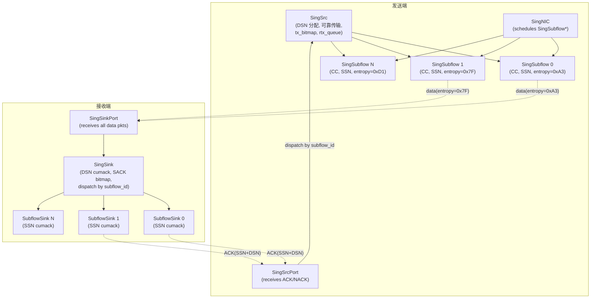
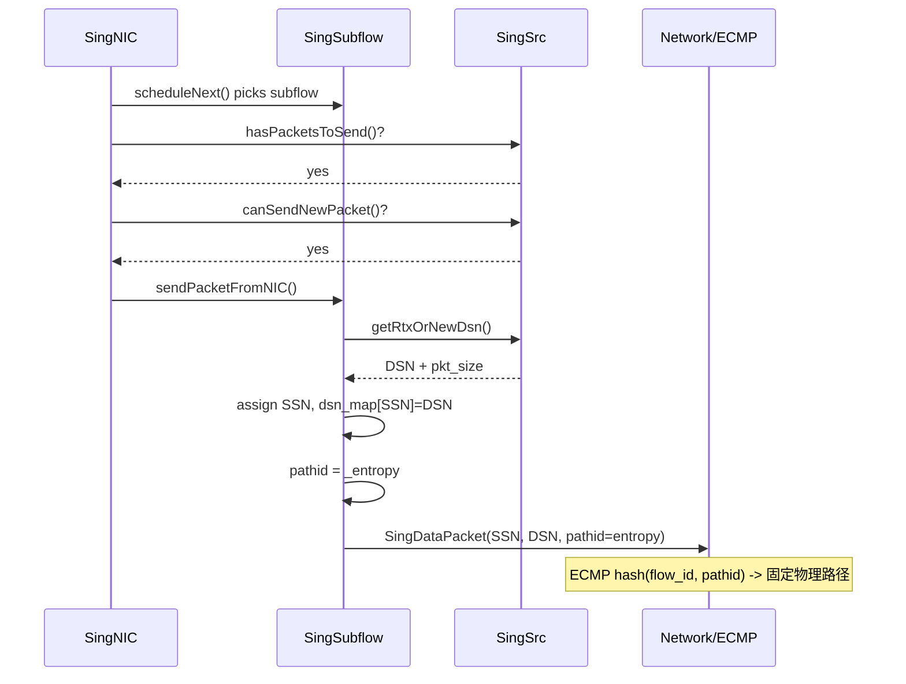
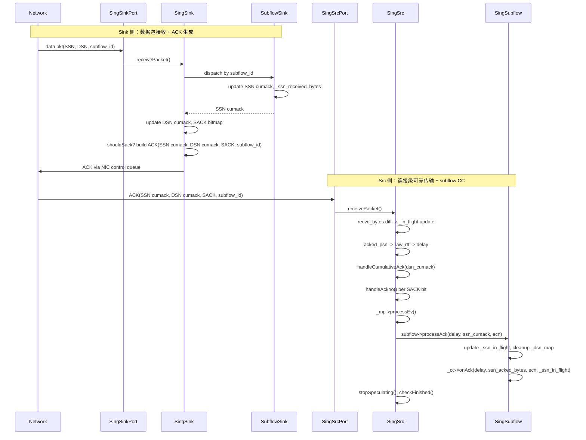
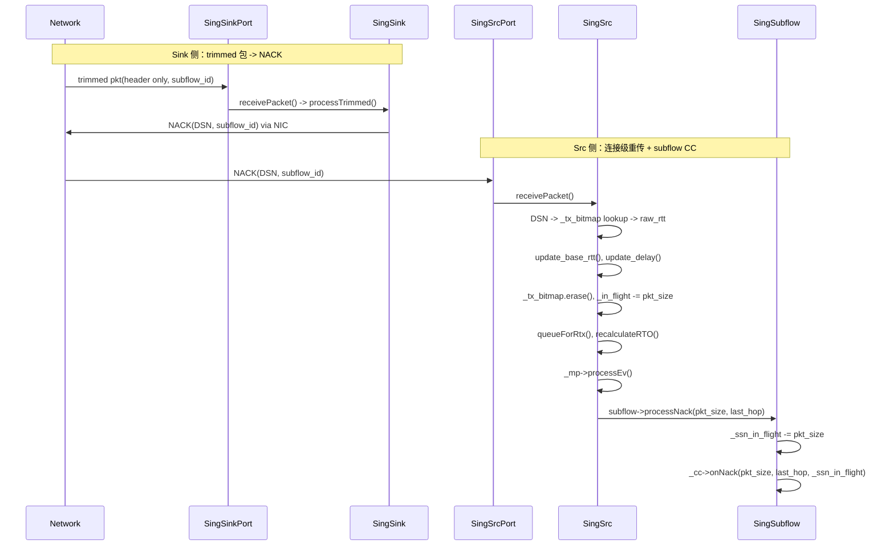

---

> 2026-03 文件拆分说明：原 `sing.cpp/sing.h` 已拆分为 `sing_src.cpp|sing_sink.cpp|sing_nic.cpp` 与对应头文件，本文中的旧行号引用已改为稳定的函数名+文件名口径。
name: Path-wise CC LB
overview: 在 Sing 框架中增加 Path-wise CC LB 支持。SingSrc 始终持有 SingSubflow（Native LB 1个，Path-wise N个）。引入双层序号（DSN/SSN）、per-subflow SubflowSink 逻辑对象，使每个子流拥有独立 CC/entropy/序号空间。路径区分复用 ECMP 机制（固定 entropy）。
todos:
  - id: todo-understand-set-route
    content: "TODO: 搞清楚 Packet::set_route / Packet::_id 在整个仿真框架中的完整作用（路由、日志、调试等）"
    status: completed
  - id: phase-a-packet-format
    content: "Phase A: 修改包格式（singpacket.h），Data/ACK/NACK 增加 DSN + subflow_id"
    status: completed
  - id: phase-a-subflow-class
    content: "Phase A: 创建 SingSubflow 类（sing_subflow.h/cpp），含独立 CC、SSN 空间、DSN 映射、固定 entropy"
    status: completed
  - id: phase-a-subflowsink-class
    content: "Phase A: 创建 SingSubflowSink 逻辑对象，SSN 追踪，委托 SingSink 处理 DSN，生成 ACK"
    status: completed
  - id: phase-b-nic-refactor
    content: "Phase B: 重构 SingNIC 调度队列从 SingSrc* 改为 SingSubflow*"
    status: completed
  - id: phase-b-src-refactor
    content: "Phase B: 重构 SingSrc：CC 移到 SingSubflow，持有 1 个 SingSubflow（Native LB），DSN 分配"
    status: completed
  - id: phase-b-sink-refactor
    content: "Phase B: 重构 SingSink：管理 SubflowSink，按 subflow_id 分发数据包，DSN 级 SACK，ACK 触发模式可配置"
    status: completed
  - id: phase-b-src-dispatch
    content: "Phase B: SingSrc 收到 ACK/NACK 后按 subflow_id 分发给对应 SingSubflow"
    status: completed
  - id: phase-b-regression
    content: "Phase B: Native LB 回归验证（单 subflow，行为不变）"
    status: completed
  - id: phase-c-pathwise
    content: "Phase C: 多 subflow Path-wise CC LB 模式，main_sing.cpp 扩展"
    status: completed
isProject: false
---

# Sing 框架 Path-wise CC LB 实施计划（v3）

## 背景

当前 Sing 框架已实现 Native LB + 四种 CC（NSCC, DCTCP, Constant, Swift）。目标是新增 **Path-wise CC LB** 模式。PLB 暂不实现。

## 核心设计决策

### 决策 1: SingSrc 始终持有 SingSubflow

- **Native LB**: SingSrc 持有 1 个 SingSubflow（行为等价于当前）
- **Path-wise CC LB**: SingSrc 持有 N 个 SingSubflow
- NIC 直接调度 `SingSubflow`*
- CC 实例从 SingSrc 移到 SingSubflow

### 决策 2: 双层序号空间（DSN / SSN）

- **DSN (Data Sequence Number)**: SingSrc 级，全局数据序号，由 SingSrc 统一分配
- **SSN (Subflow Sequence Number)**: 每个 SingSubflow 有独立的 SSN 空间
- 每个 SingSubflow 维护 `_dsn_map`: SSN -> DSN
- 数据包携带 DSN + SSN + subflow_id
- **Native LB (1 subflow)**: DSN == SSN，dsn_map 平凡映射

### 决策 3: 路径区分复用 ECMP（固定 entropy）

- **不使用显式全路径路由**（不用 Swift 风格的 `get_bidir_paths()`）
- 所有 subflow 共享同一个第一跳路由（`srctotor`，即 Host → ToR）
- 每个 subflow 创建时随机一个固定 entropy 值（`_fixed_entropy`）
- 该 subflow 所有数据包的 `pathid` 都设为这个 entropy
- 交换机用 `freeBSDHash(flow_id, pathid, salt)` 做 ECMP，同一 entropy 确保走同一物理路径
- **Native LB (1 subflow)**：entropy 来自 `_mp->nextEntropy()`（每包变化，如 REPS/Bitmap）
- **Path-wise (N subflows)**：每个 subflow 的 entropy 固定不变

### 决策 4: 包头新增 subflow_id 字段

entropy 是随机生成的，两个 subflow 可能随机到同一个 entropy，**entropy → subflow 并非单射**。因此**在包头新增 `_subflow_id` 字段**，由构造保证唯一（0, 1, ..., N-1）。

- **SingDataPacket**：新增 `uint16_t _subflow_id`
- **SingAck**：新增 `uint16_t _subflow_id`（触发该 ACK 的数据包所属 subflow）
- **SingNack**：新增 `uint16_t _subflow_id`
- **pathid/entropy**：仍用于 ECMP 哈希（决定物理路径），与 subflow_id 职责分离
- **发送端**：`SingSrc` 收到 ACK/NACK → 用 `pkt.subflow_id()` 查 `_subflow_id_to_subflow` → 分发给对应 SingSubflow
- **接收端**：`SingSink` 收到数据包 → 用 `pkt.subflow_id()` 查 `_subflow_id_to_subflowsink` → 分发给对应 SubflowSink
- **Native LB (1 subflow)**：subflow_id 恒为 0，不需要查表
- SubflowSink 不作为 Route 终点，而是 SingSink 内部管理的逻辑对象
- ACK 仍通过 NIC 控制包队列发送（`_nic.sendControlPacket()`），路由用 `SingSink::getPortRoute(0)`

### 决策 5: ACK 触发模式可配置

当前 `shouldSack()` 使用全局 `_bytes_since_last_ack` 累加。多 subflow 时支持两种模式：

- **PER_SUBFLOW**：每个 SubflowSink 独立追踪 `_bytes_since_last_ack`，各自达到阈值时触发 ACK。优点：每个 subflow 的 CC 获得更规律的反馈
- **GLOBAL**：与当前行为一致，全局累加不区分 subflow，达到阈值时为当前触发的 subflow 生成 ACK

通过配置参数选择：`enum AckTriggerMode { PER_SUBFLOW, GLOBAL }`

### 决策 6: 可靠传输保持在 SingSrc 层

- `_tx_bitmap`（keyed by DSN）、`_rtx_queue`（keyed by DSN）在 SingSrc
- 重传不绑定子流：NIC 调度到某个 subflow 时，subflow 检查 SingSrc 的 rtx_queue
- RTO 计时器在 SingSrc 层
- SACK bitmap 在 SingSink 层（DSN 级）

### 决策 7: Sleek 暂时禁用

Sleek 与 CC 紧耦合（`runSleek()` 依赖 `currentWindowBytes()` 和 OOO 计数，与 `_loss_recovery_mode` 交互复杂）。多 subflow 时，Sleek 该依赖哪个 window（单个 subflow 的还是全局的）尚未想清楚。**暂时通过 assert 将 Sleek 禁用**（Phase B 重构时在 `SingSrc` 构造函数中 `assert(!_enable_sleek)` 或等价方式），后续单独考虑 Sleek 在多 subflow 架构下的重构。

### 决策 8: NIC 调度逻辑

NIC 调度 `SingSubflow`*。`scheduleNext()` 中：

```cpp
SingSubflow* subflow = it->second;
SingSrc* src = subflow->parentSrc();
if (src->hasPacketsToSend() && src->canSendNewPacket()) {
    mem_b sent_bytes = subflow->sendPacketFromNIC();
    // ...
}
```

- `hasPacketsToSend()`: SingSrc 级（有 backlog 或 rtx_queue）
- `canSendNewPacket()`: SingSrc 级（全局限制如 max_unack_window）
- 发送速率/时机: 由 subflow 的 CC 决定（`computeNextSendTime()`）

### 决策 9: Subflow 与 SubflowSink 的关联

当前 SingSrc 和 SingSink 通过 `SingSrc::connectPort()` 关联：Src 保存 `_sink` 指针，Sink 保存 `_src` 指针。Subflow/SubflowSink 是逻辑对象，不需要路由注册，**两边用相同的 `subflow_id` 隐式关联**：

- `SingSrc::connectPort()` 时（或 `startConnection()` 时），SingSrc 创建 N 个 SingSubflow（subflow_id = 0..N-1）
- SingSrc 通知 SingSink 创建对应的 N 个 SingSubflowSink（subflow_id = 0..N-1）
- 数据包携带 `subflow_id`，Sink 侧按 `subflow_id` 分发；ACK 携带 `subflow_id`，Src 侧按 `subflow_id` 分发
- 不需要 SubflowSrc → SubflowSink 的直接指针

### 决策 10: delay 计算保留在 SingSrc 层

`BaseCC::onAck()` 接口接收 `delay` 参数（`delay = raw_rtt - _base_rtt`）。当前 `_base_rtt` 和 `update_delay()` 在 SingSrc 层维护。需要 `_base_rtt` 的 CC（如 NSCC、Swift）也在 CC 内部各自维护了自己的副本。**SingSubflow 不持有 `_base_rtt`**，而是：

- SingSrc 在 `processAck()` 中计算 `delay`（沿用当前逻辑）
- 将 `delay` 传给 `subflow->processAck(delay, ...)`
- subflow 再传给 `_cc->onAck(delay, ...)`

### 决策 11: processAck/processNack 功能边界划分

核心思路：SingSrc 先处理连接级的可靠传输逻辑，然后把 CC 相关的信息传递给 SingSubflow，由 Subflow 调用 CC。

#### SingSrc::processAck() 负责：

1. `recvd_bytes` 差值 → `newly_recvd_bytes` → `_in_flight -= newly_recvd_bytes`（连接级 in_flight）
2. 用 `acked_psn`（DSN）查 `_tx_bitmap` 计算 `raw_rtt` → `update_base_rtt()` → `delay = raw_rtt - _base_rtt`
3. `handleCumulativeAck(dsn_cumack)` — DSN 级 cumulative ack 批量清理 `_tx_bitmap`、`_rtx_queue`
4. 遍历 SACK bitmap → `handleAckno()` — DSN 级清理 `_tx_bitmap`、`_rtx_queue`
5. `_mp->processEv()` — 路径反馈（仅 Native LB 有意义）
6. `stopSpeculating()`、`checkFinished()`
7. 按 `pkt.subflow_id()` 找到对应 subflow，调用 `subflow->processAck(delay, ssn_cumack, ecn)`

#### SingSubflow::processAck() 负责：

1. 用 SSN cumack 更新 `_ssn_in_flight`（subflow 级 in_flight）
2. 清理 `_dsn_map` 中已确认的 SSN 条目
3. 计算 `ssn_acked_bytes`
4. `_cc->onAck(delay, ssn_acked_bytes, ecn, _ssn_in_flight)`

#### SingSrc::processNack() 负责：

1. 用 `nacked_seqno`（DSN）查 `_tx_bitmap`，未找到则 return
2. 提取 `pkt_size`、`raw_rtt`，`update_base_rtt()`、`update_delay()`
3. `_tx_bitmap.erase()`、`_in_flight -= pkt_size`、`delFromSendTimes()`
4. `queueForRtx()`、`recalculateRTO()`
5. `_mp->processEv()` — 路径反馈
6. `stopSpeculating()`
7. 按 `pkt.subflow_id()` 找到对应 subflow，调用 `subflow->processNack(pkt_size, last_hop)`

#### SingSubflow::processNack() 负责：

1. `_ssn_in_flight -= pkt_size`
2. `_cc->onNack(pkt_size, last_hop, _ssn_in_flight)`

## 目标架构




## 包格式变更（[singpacket.h](htsim/sim/singpacket.h)）

### SingDataPacket

当前 `_epsn` 字段变为 SSN；新增 `_dsn` 和 `_subflow_id`：

```cpp
class SingDataPacket : public SingBasePacket {
    seq_t _epsn;            // 改语义为 SSN (subflow sequence number)
    seq_t _dsn;             // 新增: Data Sequence Number (全局)
    uint16_t _subflow_id;   // 新增: 标识所属 subflow (0, 1, ..., N-1)
    // pathid (继承自 Packet) 仍用于 ECMP 哈希
};
```

### SingAck

新增 `_dsn_cumack` 和 `_subflow_id`：

```cpp
class SingAck : public SingBasePacket {
    seq_t _cumulative_ack;  // 改语义为 SSN cumulative ack
    seq_t _dsn_cumack;      // 新增: DSN cumulative ack
    uint16_t _subflow_id;   // 新增: 触发此 ACK 的数据包所属 subflow
    seq_t _ref_ack;         // DSN 级 SACK bitmap base
    uint64_t _sack_bitmap;  // DSN 级 SACK bitmap
    // _ev 保留，用于 ACK 的 ECMP 路由
};
```

### SingNack

`_ref_epsn` 改为 DSN 语义；新增 `_subflow_id`：

```cpp
class SingNack : public SingBasePacket {
    seq_t _ref_epsn;        // 改语义为 DSN (被 NACK 的全局序号)
    uint16_t _subflow_id;   // 新增: 被 NACK 的包所属 subflow
    // _ev 保留，用于 NACK 的 ECMP 路由
};
```

## 关键类设计

### SingSubflow ([sing_subflow.h](htsim/sim/sing_subflow.h)) - 新文件

```cpp
class SingSubflow {
public:
    SingSubflow(SingSrc& src, int subflow_id, unique_ptr<BaseCC> cc);

    // NIC 调度接口
    mem_b sendPacketFromNIC();
    simtime_picosec computeNextSendTime(mem_b pkt_size) const;

    // 接收 ACK/NACK（由 SingSrc 按 subflow_id 分发调用）
    void processAck(const SingAck& pkt);
    void processNack(const SingNack& pkt);

    SingSrc* parentSrc();
    int subflowId() const;
    BaseCC* cc() const;
    uint16_t entropy() const { return _entropy; }

private:
    SingSrc& _src;
    int _subflow_id;
    unique_ptr<BaseCC> _cc;
    uint16_t _entropy;  // Path-wise: 创建时随机，此后固定；仅用于 ECMP 哈希

    // SSN 空间
    SingDataPacket::seq_t _highest_ssn_sent = 0;
    mem_b _ssn_in_flight = 0;    // per-subflow in_flight (传给 CC)

    // SSN -> DSN 映射
    map<SingDataPacket::seq_t, SingDataPacket::seq_t> _dsn_map;
};
```

设计要点：

- **不继承 PacketSink**：不通过路由接收 ACK，而是由 SingSrc 按 `pkt.subflow_id()` 分发调用 `processAck()`/`processNack()`
- `**_subflow_id`**：由构造保证唯一（0, 1, ..., N-1），用于两端分发
- `**_entropy`**：仅用于 ECMP 哈希（pathid），决定物理路径
- **无 `_route` 成员**：所有 subflow 共享 SingSrc 的第一跳路由；entropy 控制实际物理路径
- **无 `_base_rtt`**：`_base_rtt` 和 `update_delay()` 保留在 SingSrc 层，SingSrc 计算 `delay = raw_rtt - _base_rtt` 后传给 subflow
- `**processAck(delay, ...)**` 直接调用 `_cc->onAck(delay, ssn_acked_bytes, ecn, _ssn_in_flight)`

#### sendPacketFromNIC() 流程

```
1. 检查 _src._rtx_queue:
   - 非空 -> 取 DSN 和 pkt_size
   - 分配 SSN (++_highest_ssn_sent)
   - _dsn_map[SSN] = DSN
   - 创建 SingDataPacket(src_route, SSN, DSN, DATA_RTX)
2. 否则检查 _src._backlog:
   - > 0 -> 分配新 DSN (_src.getNextDsn())
   - 分配 SSN
   - _dsn_map[SSN] = DSN
   - 创建 SingDataPacket(src_route, SSN, DSN, DATA_NORMAL)
3. 设置 pathid = _entropy (所有模式统一)
   - Native LB 下，单个 subflow 的 _entropy 每包重新随机（或直接用 _mp->nextEntropy()）
   - Path-wise 下，_entropy 固定不变
4. pkt->sendOn()
5. 更新 _ssn_in_flight, _src._in_flight, _src._tx_bitmap[DSN]
```

### SingSubflowSink ([sing_subflow.h](htsim/sim/sing_subflow.h))

```cpp
class SingSubflowSink {
public:
    SingSubflowSink(SingSink& sink, uint16_t entropy);

    // 由 SingSink 按 pathid(entropy) 分发调用
    void processData(SingDataPacket& pkt);
    void processTrimmed(const SingDataPacket& pkt);

    uint16_t entropy() const { return _entropy; }

private:
    SingSink& _sink;
    int _subflow_id;

    // SSN 级状态
    SingBasePacket::seq_t _expected_ssn = 0;
    SingBasePacket::seq_t _high_ssn = 0;
    mem_b _bytes_since_last_ack = 0;  // PER_SUBFLOW 模式下的 ACK 触发计数
    mem_b _ssn_received_bytes = 0;  // SSN 级别的已接收字节（用于 ACK 中的 ssn_acked_bytes）
};
```

设计要点：

- **不继承 PacketSink**：不通过路由接收数据包，而是由 SingSink 分发调用
- `**_subflow_id`**：与发送端 SingSubflow 的 `_subflow_id` 对应
- `**_bytes_since_last_ack`**：PER_SUBFLOW ACK 触发模式下，各 SubflowSink 独立累计，独立判断 shouldSack
- **不直接发送 ACK**：`processData()` 更新 SSN 状态后返回 SSN cumack 等信息，由 SingSink 统一构建和发送 ACK（ACK 包含 SSN cumack + DSN cumack）

### SingSrc 变更 ([sing_src.h/sing_sink.h/sing_nic.h](htsim/sim/sing_src.h/sing_sink.h/sing_nic.h))

- **移除** `unique_ptr<BaseCC> _cc`（CC 移到 SingSubflow）
- **新增** `vector<unique_ptr<SingSubflow>> _subflows`
- **新增** DSN 分配: `_highest_dsn_sent`, `getNextDsn()`
- **保留** `_mp`（仅 Native LB 使用）
- **保留** `_tx_bitmap`, `_rtx_queue`, `_in_flight`（DSN 级可靠传输）
- **保留** RTO 计时器（DSN 级超时）
- **新增** `_entropy_to_subflow` map：`unordered_map<uint16_t, SingSubflow*>`
- **新增** `receivePacket` 中按 `pkt.ev()` (entropy) 查 `_entropy_to_subflow` 分发 ACK/NACK 给对应 SingSubflow

### SingSink 变更 ([sing_src.h/sing_sink.h/sing_nic.h](htsim/sim/sing_src.h/sing_sink.h/sing_nic.h))

- **新增** `vector<unique_ptr<SingSubflowSink>> _subflow_sinks`
- **新增** `_subflow_id_to_subflowsink` map：`unordered_map<int, SingSubflowSink*>`
- **新增** ACK 触发模式：`enum AckTriggerMode { PER_SUBFLOW, GLOBAL }`，静态配置参数
- **新增** `processData` 中根据 `pkt.subflow_id()` 先分发给 SubflowSink 更新 SSN
- `_expected_epsn` **语义改为** `_expected_dsn`（DSN 级 cumulative ack）
- `_epsn_rx_bitmap` **语义改为** DSN 级 bitmap
- SACK 构建函数（`buildSackBitmap`, `sackBitmapBase`）**按 DSN 操作**
- ACK 构建时包含 SSN cumack（来自 SubflowSink）+ DSN cumack（来自 SingSink）

### SingNIC 变更 ([sing_src.h/sing_sink.h/sing_nic.h](htsim/sim/sing_src.h/sing_sink.h/sing_nic.h))

```cpp
std::multimap<simtime_picosec, SingSubflow*> _data_schedule_queue;
std::set<SingSubflow*> _scheduled_subflows;

void registerSubflowForScheduling(SingSubflow* sf, simtime_picosec next_send_time);
void unregisterSubflow(SingSubflow* sf);
void rescheduleSubflow(SingSubflow* sf, simtime_picosec next_send_time);
```

`scheduleNext()` 逻辑不变，只是操作对象从 `SingSrc*` 变为 `SingSubflow*`，通过 `sf->parentSrc()` 访问 SingSrc 的 `hasPacketsToSend()` / `canSendNewPacket()`。

## 数据流图

### 发送路径




### 接收/ACK路径



### NACK路径




## 实施分阶段

### Phase A: 基础设施（新文件 + 包格式）

不修改现有行为，只增加新类和包格式字段。

1. 修改 `singpacket.h`: Data/ACK/NACK 加 `_dsn` 和 `_subflow_id`
2. 创建 `sing_subflow.h/cpp`: SingSubflow 和 SingSubflowSink 类定义及实现

### Phase B: 单 subflow 重构（Native LB 等价）

将 SingSrc 重构为"始终持有 1 个 SingSubflow"模式。

1. SingNIC: `SingSrc*` -> `SingSubflow*`
2. SingSrc: 移除 `_cc`，创建 1 个 SingSubflow，CC 在 subflow 中
3. SingSrc: 新增 `_highest_dsn_sent`, `getNextDsn()`（初始阶段 DSN==SSN）
4. SingSink: 管理 1 个 SingSubflowSink，按 subflow_id 分发数据包；新增 AckTriggerMode 配置
5. SingSrc: ACK/NACK 按 subflow_id 分发给 SingSubflow
6. 回归测试：跑通现有 4-case CC regression，确保行为不变

### Phase C: 多 subflow Path-wise 模式

在 Phase B 基础上扩展到 N 个 subflow。

1. SingSrc: 新增 Path-wise 模式，创建 N 个 SingSubflow（各有固定 entropy）
2. main_sing.cpp: 新增 `-pathwise_subflows <N>` 参数
3. SingSink: 管理 N 个 SingSubflowSink
4. 测试: 多 subflow + Swift/NSCC CC

## 注意事项

- **Phase B 是关键**：必须确保单 subflow 重构后 Native LB 完全兼容，再进入 Phase C
- **DSN/SSN 在单 subflow 时平凡**: DSN == SSN，dsn_map 虽存在但是 1:1 映射
- **重传自然通过 NIC 调度**: subflow 的 `sendPacketFromNIC()` 先检查 `_src._rtx_queue`
- **entropy 选择**:
  - Native LB (1 subflow): 仍用 `_mp->nextEntropy()`（每包变化，保持 REPS/Bitmap 等策略）。因为只有 1 个 subflow，ACK/数据包分发是平凡的（直接给唯一的 subflow），不需要 entropy 查表
  - Path-wise (N subflows): 每个 subflow 创建时 `_entropy = random()`，此后不变。entropy 仅用于 ECMP 路径固定；subflow 标识用 subflow_id
- **RTO timeout**: SingSrc 级事件，触发时需通知相关 subflow
- **预计代码量**: sing_subflow.h/cpp ~600 行新增，sing_src.h/sing_sink.h/sing_nic.h/cpp/singpacket.h ~500 行修改

## 附录：包头大小定义


| 类型             | 定义位置                                             | 默认值  | 说明                                                               |
| -------------- | ------------------------------------------------ | ---- | ---------------------------------------------------------------- |
| **数据包 header** | `sing_src.cpp/sing_sink.cpp/sing_nic.cpp` `SingSrc::_hdr_size = 64`          | 64 B | 静态变量，可在 main_sing.cpp 中通过 `_mtu` 间接覆盖（`_mss = _mtu - _hdr_size`） |
| **ACK/NACK 包** | `singpacket.h:25` `SingBasePacket::ACKSIZE = 64` | 64 B | 常量，ACK/NACK 包总大小                                                 |
| **数据包总大小**     | `set_route(flow, route, full_size, epsn)`        | 可变   | `full_size = payload + _hdr_size`，payload 通常为 MSS 或更小            |


