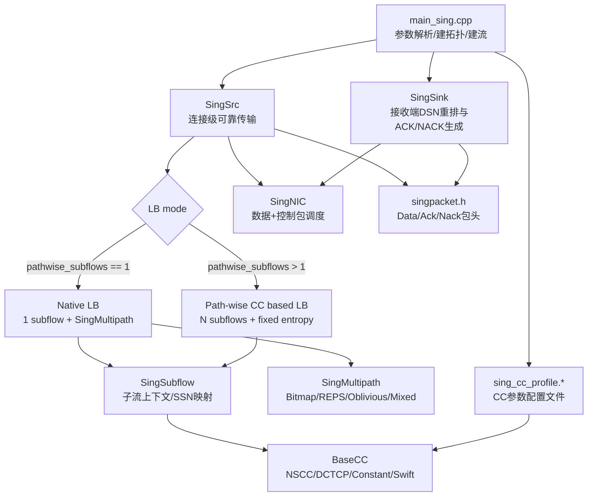
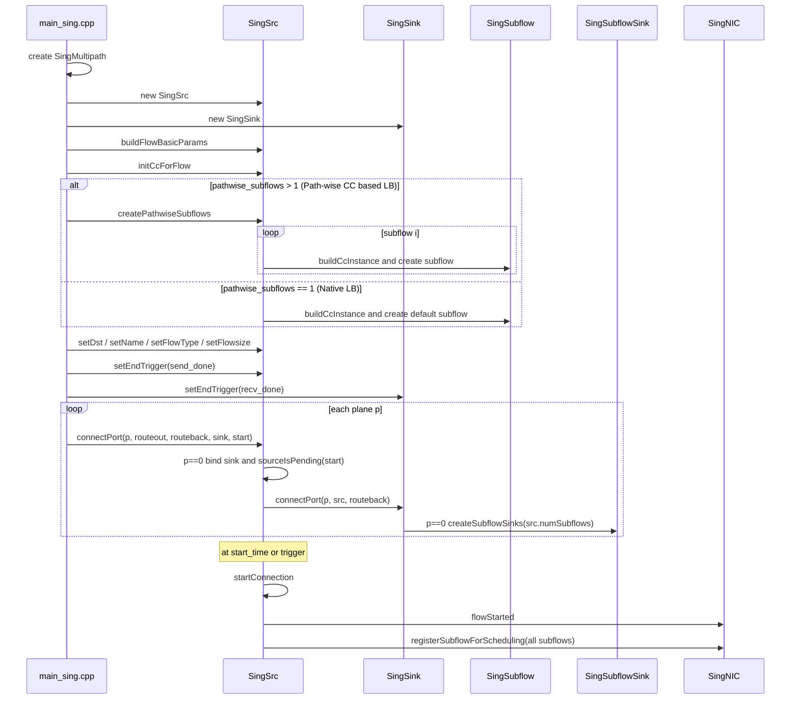
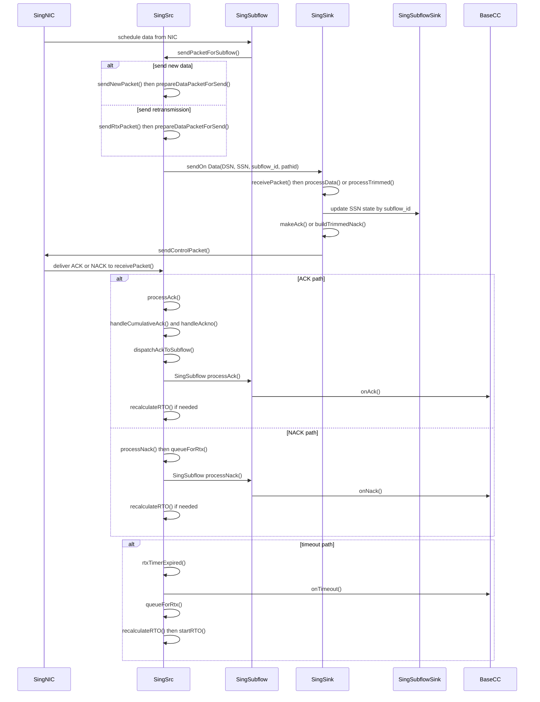

# SING 框架快速上手指南（面向 Coding Agent 与 User）

> 2026-03 文件拆分说明：原 `sing.cpp/sing.h` 已拆分为 `sing_src|sing_sink|sing_nic`，且 `SingSrc` 实现已进一步拆为 `sing_src.cpp`（core/init）+ `sing_src_rx.cpp` + `sing_src_tx.cpp` + `sing_src_rto.cpp` + `sing_src_sleek.cpp`。本文统一使用“函数名 + 文件名”口径。

## 1. 文档定位与阅读路径（3 分钟）

这份文档的目标是帮助你在 10-15 分钟内快速建立对当前 SING 仿真框架的工作认知（以当前代码事实为准），并能直接开始开发或验证。

- 面向对象：
  - `coding agent`：快速定位改动入口与验证入口
  - `user`：快速理解架构、模块关系、常用运行与回归方法
- 不覆盖：
  - 历史讨论过程
  - 大规模参数扫参与论文级实验设计

推荐阅读顺序：

1. 先看第 2 节总览图（理解模块边界）
2. 再看第 4 节初始化流程（理解建流、CC 初始化与端到端绑定）
3. 再看第 5 节运行态数据路径（理解包与 ACK/NACK 如何流动）
4. 然后看第 6 节运行模式与关键开关（理解怎么配置）
5. 最后按第 7 节直接跑回归（验证你理解的配置是否正确）

深入路径：

1. 第 3 节模块职责表对应源码
2. 第 8 节按任务类型直接跳到实现文件
3. 第 9 节进入细分讨论文档

---

## 2. 一图看懂 SING（总览图）



模式边界（按当前代码口径）：

- `pathwise_subflows == 1`：`Native LB`，由 `SingMultipath` 参与 path 选择。
- `pathwise_subflows > 1`：`Path-wise CC based LB`，每个 subflow 固定 entropy。
- 两套体系互不交叠：先判定模式，再看对应发送/反馈路径。

---

## 3. 核心模块职责表（文件到职责映射）

| 文件 | 角色 | 你通常在这里改什么 |
|---|---|---|
| `htsim/sim/sing_src.cpp` + `htsim/sim/sing_src_{rx,tx,rto,sleek}.cpp` / `htsim/sim/sing_src.h` | `SingSrc` 主体（按 core/rx/tx/rto/sleek 分层） | CC 初始化、ACK/NACK 处理、发送路径、RTO 机制、Sleek 保留逻辑 |
| `htsim/sim/sing_sink.cpp/sing_nic.cpp` / `htsim/sim/sing_sink.h/sing_nic.h` | `SingSink`、`SingNIC` 主体 | 接收端 SACK/NACK 行为、ACK Policy（legacy/reps_ackagg）策略分流、NIC 调度与队列、控制包优先级 |
| `htsim/sim/sing_subflow.cpp` / `htsim/sim/sing_subflow.h` | 子流抽象：`SingSubflow`、`SingSubflowSink` | per-subflow 的 SSN 映射、subflow 级 in-flight、CC 调用入口 |
| `htsim/sim/sing_cc.cpp` / `htsim/sim/sing_cc.h` | 拥塞控制插件层：`BaseCC` + `Nscc`/`Dctcp`/`Constant`/`Swift` | CC 算法参数、ACK/NACK/Timeout 控制律 |
| `htsim/sim/sing_mp.cpp` / `htsim/sim/sing_mp.h` | 多路径负载均衡策略 | `nextEntropy()` 选路策略与 `processEv()` 路径反馈处理 |
| `htsim/sim/singpacket.h` | 包格式定义 | Data/Ack/Nack 字段（含 `dsn`/`ssn`/`subflow_id`） |
| `htsim/sim/datacenter/main_sing.cpp` | 仿真入口 | 参数解析、建拓扑、建连接、调用 `initCcForFlow/createPathwiseSubflows` |
| `htsim/sim/sing_cc_profile.cpp` / `htsim/sim/sing_cc_profile.h` | CC 配置文件加载与表达式求值 | `-cc_profile` 参数映射、按 flow/global 上下文解析参数 |

`SingSrc` 文件分层（当前代码）：

- `sing_src.cpp`：静态配置、构造/生命周期、CC 初始化、pathwise subflow 创建
- `sing_src_rx.cpp`：`processAck/processNack`、ACK/SACK 清账、完成判定
- `sing_src_tx.cpp`：发送路径、封包、路径选择、发送记录与重传队列入队
- `sing_src_rto.cpp`：RTO 定时器、超时处理、重算与 timeout 反馈
- `sing_src_sleek.cpp`：`runSleek()`（保留逻辑，当前未启用）

---

## 4. Flow 初始化流程（从建流到可发送）

本节描述首次建流主路径（非 `conn_reuse`）。`conn_reuse` 场景会复用已有连接，仅追加消息入队，不重复执行完整建连流程。



初始化阶段可按下面 6 步记忆（对应当前代码）：

1. `main_sing.cpp` 为每个连接创建 `SingMultipath`、`SingSrc`、`SingSink`，再计算 flow 级参数并调用 `buildFlowBasicParams()`。
2. `main_sing.cpp` 调用 `initCcForFlow()` 完成 flow 级 CC 初始化；若启用 `Path-wise CC based LB`，再调用 `createPathwiseSubflows()`。
3. `SingSrc` 侧创建 `SingSubflow`（`Native LB` 为 1 个；`Path-wise CC based LB` 为 N 个）并绑定对应 CC 实例。
4. `main_sing.cpp` 继续设置 `setDst/setName/setFlowType/setFlowsize` 与 send/recv done trigger。
5. `main_sing.cpp` 按 plane 循环调用 `SingSrc::connectPort()`；该调用会级联到 `SingSink::connectPort()`，并在 `p==0` 时创建 `SingSubflowSink` 数组。
6. 到达 `start_time` 或触发条件后，`SingSrc::startConnection()` 执行并向 NIC 注册全部 subflow，连接进入可发送状态。

---

## 5. 关键数据路径（发送 / ACK / NACK / RTO）

本节描述连接已启动后的运行态收发与重传逻辑。

先记住三个关键字段：

- `DSN`：连接级数据序号（全局可靠传输索引）
- `SSN`：子流级序号（每个 subflow 独立推进）
- `subflow_id`：ACK/NACK 分发标识（发送端按它回到对应 subflow）

字段解释建议按模式理解：

- `Native LB`（`pathwise_subflows == 1`）：
  - 仍有 `DSN/SSN/subflow_id` 字段，但只有 1 个 subflow；
  - `SSN` 在单 subflow 语境中推进，工程上常与 `DSN` 同步增长；
  - path 选择由 `SingMultipath` 驱动。
- `Path-wise CC based LB`（`pathwise_subflows > 1`）：
  - `DSN` 始终是 flow 全局序号；
  - `SSN` 在每个 subflow 内独立推进；
  - `subflow_id` 是 ACK/NACK 反馈分发到对应 subflow/CC 的关键索引。



函数映射说明：

- 图中只标关键函数；例如发送链路的 `createSendRecord()/startRTO()` 在 `sendNewPacket()/sendRtxPacket()` 内执行。
- ACK 清账的细节 helper（如时钟/RTT 采样、SACK 遍历）都在 `processAck()` 内部编排，图中不逐个展开。
- NACK 与 timeout 最终都通过 `queueForRtx()` 汇入重传队列，后续由 `sendRtxPacket()` 发送。
- sink 侧 ACK/NACK 生成入口是 `receivePacket() -> processData()/processTrimmed()`，再经 `makeAck()/buildTrimmedNack()` 下发控制包。
- 本图是运行态主路径，不覆盖 `conn_reuse` 的初始化复用分支。

---

## 6. 运行模式与关键开关（当前实现口径）

### 6.1 Native LB vs Path-wise CC based LB（下文简称 Path-wise）

- Native LB（默认）：
  - 触发条件：`-pathwise_subflows 1`（或未显式设置，保持默认 1）。
  - `SingSrc` 持有 1 个 `SingSubflow`。
  - path 选择由 `SingMultipath` 负责（如 Bitmap/REPS/Oblivious/Mixed）。
- Path-wise CC based LB：
  - 触发条件：`-pathwise_subflows N` 且 `N > 1`。
  - `SingSrc` 持有多个 subflow，每个 subflow 创建时分配固定 entropy。
  - 这是 subflow 体系下的 CC-based LB，不是 `Native LB` 的 `SingMultipath` 选路流程。

> 关键口径：`Native LB` 与 `Path-wise CC based LB` 是两套互不交叠的运行体系，先判定 `pathwise_subflows` 再理解行为。

### 6.1.1 DSN/SSN/subflow_id 在两种模式下怎么读

- `DSN`：无论哪种模式，都是 flow 全局序号。
- `SSN`：
  - `Native LB`：单 subflow 语境下的子流序号。
  - `Path-wise CC based LB`：每个 subflow 独立序号空间。
- `subflow_id`：
  - 两种模式都存在该字段；
  - 在 `Path-wise CC based LB` 中更关键，用于 ACK/NACK 到 subflow/CC 的精确分发。

### 6.2 Sender-CC 算法选择

通过 `-sender_cc_algo` 选择：

- `nscc`
- `dctcp`
- `constant`
- `swift`

对应实现在 `sing_cc.*`。

可执行示例：

```bash
# Native LB + NSCC（单 subflow，SingMultipath 参与选路）
./htsim_sing -sender_cc_only -sender_cc_algo nscc ...

# Path-wise CC based LB (4 subflows) + Swift（多 subflow 固定 entropy）
./htsim_sing -sender_cc_only -sender_cc_algo swift -pathwise_subflows 4 ...
```

### 6.3 `-cc_profile` 与 `.cm` flow 级覆盖

全局开关：
- `-cc_profile <json>`：加载 profile 文件（`cc.defaults` + `cc.profiles`）。
- `-sender_cc_algo <algo>`：给未显式覆盖的 flow 提供全局算法。

flow 级覆盖（`.cm`）：
- `cc_algo <nscc|dctcp|constant|swift>`
- `cc_profile <profile_id>`

优先级：
1. flow 写了 `cc_profile`：优先用该 profile；若同时写 `cc_algo`，必须与 profile 的 `algo` 一致。
2. flow 只写 `cc_algo`：算法用 flow 指定；profile 用 `cc.defaults[algo]`（若存在）。
3. flow 两者都不写：走全局 CLI。

最小示例：

```text
Nodes 2
Connections 2
0->1 start 0 size 10000 id 101 cc_algo dctcp
0->1 start 0 size 10000 id 102 cc_profile swift_test
```

```bash
./htsim_sing \
  -tm /tmp/flow_cc_demo.cm \
  -sender_cc_algo nscc \
  -cc_profile htsim/sim/datacenter/cc_profiles/test_overrides.json \
  -end 10
```

`conn_reuse` 约束：
- 同一 `flowid` 首条连接定义可写 `cc_algo/cc_profile`；
- 后续复用消息行禁止再写 cc 字段（否则启动即报错）。

### 6.4 Sleek 当前状态（按代码事实）

- CLI 仍支持 `-sleek` 开关（`main_sing.cpp`）
- 但在当前 subflow 架构下，`SingSrc::initCcForFlow()` 中若 `_enable_sleek=true` 会直接报错并终止（`htsim/sim/sing_src.cpp` 中显式 `abort()`）
- 因此涉及 Sleek 的实验语义，请始终以当前分支代码行为为准

---

## 7. 回归验证：cc-regression-runner 使用说明（可直接复制）

本节基于：

- `skills/cc-regression-runner/SKILL.md`
- `skills/cc-regression-runner/scripts/run_cc_regression.sh`
- `htsim/sim/datacenter/lb_explore/cc_regression_4cases.json`

### 7.1 前置条件

确保 `htsim/sim/datacenter/htsim_sing` 已构建且可执行。

### 7.2 推荐命令

```bash
bash skills/cc-regression-runner/scripts/run_cc_regression.sh
```

脚本内部会在 `htsim/sim/datacenter` 下执行：

```bash
python3 exp_runner.py -c lb_explore/cc_regression_4cases.json
```

### 7.3 结果产物

- `htsim/sim/datacenter/lb_results/cc_regression_4cases/cc_regression_summary.csv`
- `htsim/sim/datacenter/lb_results/cc_regression_4cases/cc_regression_summary.md`

### 7.4 重点指标

- `fct_mean_us`
- `fct_p99_us`
- `slowdown_mean`
- `nacks_agg`
- `rtx_pkts`
- `sleek_pkts`

### 7.5 “4-case baseline” 与 Swift 的关系（避免歧义）

- 技能文档语义是传统 4-case 基线：
  - `nscc_sleek_on`
  - `nscc_sleek_off`
  - `dctcp`
  - `constant`
- 当前仓库中的 `cc_regression_4cases.json` 已包含额外 `swift` case  
  建议口径：**“4-case baseline + swift 扩展 case”**

额外检查建议：

- 若某个 case 汇总结果出现 `flows=0`，按 skill 约定视为无效运行，需先排查配置/运行环境再比较指标

---

## 8. Agent 实操索引（改哪里、先看哪里）

### 8.1 改 CC 算法（逻辑/参数）

1. `htsim/sim/sing_cc.h`（接口与类定义）
2. `htsim/sim/sing_cc.cpp`（控制律）
3. `htsim/sim/sing_src.cpp` 中 `buildCcInstance()`（接入点）
4. `htsim/sim/datacenter/main_sing.cpp`（CLI 选择）

### 8.2 改 ACK/NACK 处理与重传

1. `htsim/sim/sing_src_rx.cpp` + `htsim/sim/sing_src_rto.cpp`：
   - `processAck()`
   - `processNack()`
   - `handleCumulativeAck()`
   - `handleAckno()`
   - `rtxTimerExpired()`
2. `htsim/sim/singpacket.h`（如需改包字段）

### 8.3 改 Path-wise CC based LB 行为或 Subflow 语义

1. `htsim/sim/sing_subflow.cpp/.h`
2. `htsim/sim/sing_src.cpp`（`createPathwiseSubflows()`）+ `htsim/sim/sing_src_tx.cpp`（发包路径）
3. `htsim/sim/datacenter/main_sing.cpp`（`-pathwise_subflows` 参数入口）

### 8.4 改负载均衡策略

1. `htsim/sim/sing_mp.cpp/.h`
2. `htsim/sim/datacenter/main_sing.cpp`（`-load_balancing_algo`）

### 8.5 改回归配置与验证

1. `skills/cc-regression-runner/SKILL.md`（流程说明）
2. `skills/cc-regression-runner/scripts/run_cc_regression.sh`（运行封装）
3. `htsim/sim/datacenter/lb_explore/cc_regression_4cases.json`（case 定义）

### 8.6 改 ACK 反馈策略（AckPolicy）

1. `htsim/sim/sing_sink.h`（`AckPolicy` 接口与策略类定义）
2. `htsim/sim/sing_sink.cpp`（`processData` 骨架 + policy 实现）
3. `htsim/sim/sing_src_rx.cpp`（如策略需要源端 ACK 反馈配合）
4. 详见：`discussion/SING_ACK_POLICY.md`

---

## 9. 相关文档跳转（延伸阅读）

- 收敛版设计：`discussion/SING_FRAMEWORK_DESIGN_CONVERGED.md`
- 历史设计稿：`discussion/SING_FRAMEWORK_DESIGN.md`
- Path-wise CC based LB 计划：`discussion/Path-wise-CC-LB-Plan.md`
- 可靠传输详解：`discussion/SING_RELIABILITY_MECHANISM.md`
- ACK Policy 设计与 RepsAckAgg 示例：`discussion/SING_ACK_POLICY.md`
- CC profile 设计：`discussion/CC_PROFILE_ARCHITECTURE.md`
- CC profile 测试报告：`discussion/CC_PROFILE_TEST_REPORT.md`
