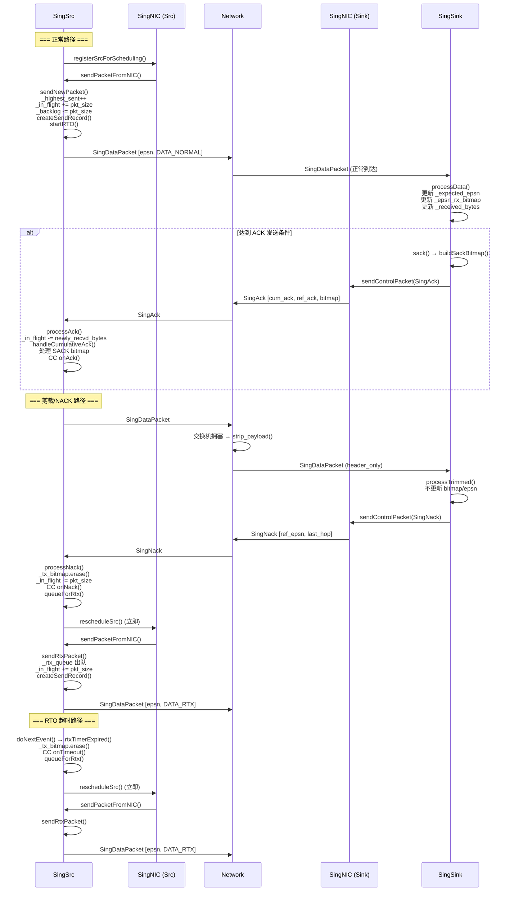
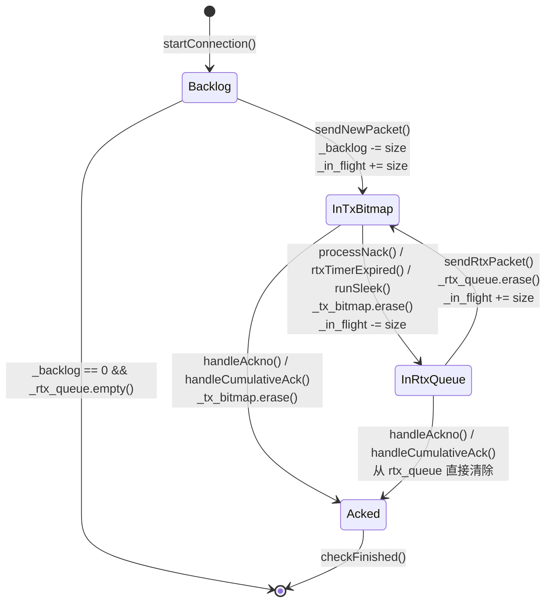

# Sing 框架可靠传输机制详解

> 2026-03 文件拆分说明：原 `sing.cpp/sing.h` 已拆分为 `sing_src.cpp+sing_src_{rx,tx,rto,sleek}.cpp|sing_sink.cpp|sing_nic.cpp` 与对应头文件，本文中的旧行号引用已改为稳定的函数名+文件名口径。

> 本文档细致梳理 htsim 仿真框架中 Sing 框架的可靠传输机制，涵盖序号管理、发送端状态追踪、重传机制、接收端处理、ACK/NACK 处理及完整数据流。
> 
> 涉及文件：`sing_src.h/sing_sink.h/sing_nic.h`、`sing_src*.cpp/sing_sink.cpp/sing_nic.cpp`、`singpacket.h`
>
> 2026-03 代码状态补充：`SingSrc` 已分层为 `sing_src.cpp`（core/init）+ `sing_src_rx.cpp` + `sing_src_tx.cpp` + `sing_src_rto.cpp` + `sing_src_sleek.cpp`。本文后续部分若出现 `_cc` / `stopSpeculating` / `can_send_NSCC` 等旧符号，应以当前代码实现为准（这些符号在现分支已移除或改为 subflow 分发路径）。

---

## 1. 序号空间

### 1.1 序号类型

```cpp
// singpacket.h:21
typedef uint64_t seq_t;
```

序号类型为 64 位无符号整数，在仿真中永不回绕。实际硬件实现中需处理序号回绕。

### 1.2 序号单位：**包**（而非字节）

Sing 的序号空间以**包**为单位。每发送一个新包，`_highest_sent` 递增 1：

```cpp
// sing_src*.cpp/sing_sink.cpp/sing_nic.cpp
_highest_sent++;
```

这与 TCP 使用字节序号的做法不同。所有序号相关操作（cumulative ack、SACK bitmap、rtx_queue 等）均以包序号为索引。

### 1.3 `_highest_sent` 的分配

`_highest_sent` 在 `SingSrc` 构造函数中初始化为 0（sing_src*.cpp/sing_sink.cpp/sing_nic.cpp），每次发送新包时用作当前包的 `_epsn` 并递增：

```cpp
// sing_src*.cpp/sing_sink.cpp/sing_nic.cpp
auto* p = SingDataPacket::newpkt(_flow, route, _highest_sent, full_pkt_size, ptype, _dstaddr);
// ...
// sing_src*.cpp/sing_sink.cpp/sing_nic.cpp
_highest_sent++;
```

重传包复用原始序号（从 `_rtx_queue` 取出），不消耗新的 `_highest_sent`：

```cpp
// sing_src*.cpp/sing_sink.cpp/sing_nic.cpp
auto seq_no = _rtx_queue.begin()->first;
// ...
auto* p = SingDataPacket::newpkt(_flow, route, seq_no, full_pkt_size, SingDataPacket::DATA_RTX, _dstaddr);
```

### 1.4 SingDataPacket 中 `_epsn` 的赋值

在 `SingDataPacket::newpkt()` 中（singpacket.h:34-62），`_epsn` 直接赋值为传入的序号参数：

```cpp
// singpacket.h:43
p->_epsn = epsn;
```

`_epsn` 用于：
- 接收端判断包是否为期望的下一个包（与 `_expected_epsn` 比较）
- 接收端在 `_epsn_rx_bitmap` 中标记已收到的乱序包
- ACK/NACK 回传时引用被确认/否认的包序号

---

## 2. 发送端状态追踪

### 2.1 `_tx_bitmap`：已发送未确认的包追踪

**类型定义：**

```cpp
// sing_src.h/sing_sink.h/sing_nic.h
struct sendRecord {
    sendRecord(mem_b psize, simtime_picosec stime) : pkt_size(psize), send_time(stime) {};
    mem_b pkt_size;
    simtime_picosec send_time;
};

// sing_src.h/sing_sink.h/sing_nic.h
map<SingDataPacket::seq_t, sendRecord> _tx_bitmap;
```

`_tx_bitmap` 是一个有序 map，键为包序号，值为 `sendRecord`（包含包大小和发送时间）。

**入队（发包时）：** 通过 `createSendRecord()` 在发送新包或重传包时插入：

```cpp
// sing_src*.cpp/sing_sink.cpp/sing_nic.cpp
void SingSrc::createSendRecord(SingBasePacket::seq_t seqno, mem_b full_pkt_size) {
    assert(_tx_bitmap.find(seqno) == _tx_bitmap.end());
    _tx_bitmap.emplace(seqno, sendRecord(full_pkt_size, eventlist().now()));
    _send_times.emplace(eventlist().now(), seqno);
    if (_rtx_times.find(seqno) == _rtx_times.end()) {
        _rtx_times.emplace(seqno, 0);       // 首次发送：重传次数=0
    } else {
        _rtx_times[seqno] += 1;             // 重传：次数+1
    }
}
```

**出队（确认时）：** 在以下函数中移除：
- `handleAckno()`（sing_src*.cpp/sing_sink.cpp/sing_nic.cpp）：SACK bitmap 中的单个确认
- `handleCumulativeAck()`（sing_src*.cpp/sing_sink.cpp/sing_nic.cpp）：cumulative ACK 批量确认
- `processNack()`（sing_src*.cpp/sing_sink.cpp/sing_nic.cpp）：NACK 触发后移除并加入重传队列
- `runSleek()`（sing_src*.cpp/sing_sink.cpp/sing_nic.cpp）：Sleek 丢包恢复模式

### 2.2 辅助追踪结构

```cpp
// sing_src.h/sing_sink.h/sing_nic.h
multimap<simtime_picosec, SingDataPacket::seq_t> _send_times;  // 按发送时间索引
// sing_src.h/sing_sink.h/sing_nic.h
map<SingDataPacket::seq_t, uint16_t> _rtx_times;               // 每包重传次数
```

- `_send_times`：用于 RTO 计时器定位最早发出的包
- `_rtx_times`：用于 `validateSendTs()` 判断 RTT 采样的有效性（避免 RTT 歧义问题）

### 2.3 `_in_flight`：在途字节数

**类型：** `mem_b`（即 `int64_t`，字节单位）

**增加时机：**
- `sendNewPacket()`（sing_src*.cpp/sing_sink.cpp/sing_nic.cpp）：`_in_flight += full_pkt_size`
- `sendRtxPacket()`（sing_src*.cpp/sing_sink.cpp/sing_nic.cpp）：`_in_flight += full_pkt_size`
- `handleAckno()` 中从 rtx_queue 移除时（sing_src*.cpp/sing_sink.cpp/sing_nic.cpp）：`_in_flight += pkt_size`（恢复之前在 mark 时扣除的部分）
- `handleCumulativeAck()` 中从 rtx_queue 移除时（sing_src*.cpp/sing_sink.cpp/sing_nic.cpp）：同上

**减少时机：**
- `processAck()`（sing_src*.cpp/sing_sink.cpp/sing_nic.cpp）：`_in_flight -= newly_recvd_bytes`（基于接收端的 recvd_bytes 反馈）
- `processNack()`（sing_src*.cpp/sing_sink.cpp/sing_nic.cpp）：`_in_flight -= pkt_size`
- `mark_packet_for_retransmission()`（sing_src*.cpp/sing_sink.cpp/sing_nic.cpp）：`_in_flight -= pktsize`
- `runSleek()`（sing_src*.cpp/sing_sink.cpp/sing_nic.cpp）：`_in_flight -= pkt_size`

> 注意：`_in_flight` 的维护比较复杂。在某些路径中先减后增（如 handleAckno 处理 rtx_queue 中的包），所以中间可能出现短暂的负值。

### 2.4 `_highest_sent`：下一个新包序号

**类型：** `SingDataPacket::seq_t`（`uint64_t`）

**初始值：** 0（sing_src*.cpp/sing_sink.cpp/sing_nic.cpp）

**更新时机：** 仅在 `sendNewPacket()` 的最后递增（sing_src*.cpp/sing_sink.cpp/sing_nic.cpp），重传包不影响此值。

**含义：** `_highest_sent` 等于"已发送的最大新包序号 + 1"，即下一个待发新包将使用的序号。

### 2.5 `_max_unack_window` / `canSendNewPacket()`

```cpp
// sing_src.h/sing_sink.h/sing_nic.h
mem_b _max_unack_window;
```

初始化为 0（sing_src*.cpp/sing_sink.cpp/sing_nic.cpp），0 表示不限制。`canSendNewPacket()` 中的检查：

```cpp
// sing_src*.cpp/sing_sink.cpp/sing_nic.cpp
bool SingSrc::canSendNewPacket() const {
    if (!_rtx_queue.empty()) {
        return true;                    // 重传包始终优先发送
    }
    if (_max_unack_window > 0 && _in_flight >= _max_unack_window) {
        return false;                   // 超出最大未确认窗口
    }
    return true;
}
```

`can_send_NSCC()` 已在当前分支移除。当前发送门控主要是：

- `canSendNewPacket()`：控制是否允许发送（例如 `_max_unack_window` 与重传优先）
- `SingSubflow::computeNextSendTime()` + `SingNIC` 调度：由 subflow 级 CC 决定发送节奏

### 2.6 `_backlog`：待发送数据量

**类型：** `mem_b`（字节）

**初始化：** 在 `startConnection()` 中计算，包含数据和头部开销：

```cpp
// sing_src*.cpp/sing_sink.cpp/sing_nic.cpp
_backlog = ceil(((double)_flow_size) / _mss) * _hdr_size + _flow_size;
```

**递减：** 每发一个新包减去该包大小（sing_src*.cpp/sing_sink.cpp/sing_nic.cpp）：

```cpp
_backlog -= full_pkt_size;
```

**用途：** 当 `_backlog == 0` 且 `_rtx_queue` 为空时，表示无新数据可发。`hasPacketsToSend()` 检查：

```cpp
// sing_src*.cpp/sing_sink.cpp/sing_nic.cpp
bool SingSrc::hasPacketsToSend() const {
    return (_backlog > 0 || !_rtx_queue.empty());
}
```

### 2.7 旧版投机发送机制（已删除）

`_credit / _speculating / stopSpeculating()` 属于旧版机制，已在当前分支清理，不再参与 Sing 发送路径。

---

## 3. 重传机制

### 3.1 `_rtx_queue`：重传队列

**类型定义：**

```cpp
// sing_src.h/sing_sink.h/sing_nic.h
map<SingDataPacket::seq_t, mem_b> _rtx_queue;
```

有序 map：键为包序号（保持序号有序），值为包大小。

**入队（`queueForRtx()`）：**

```cpp
// sing_src*.cpp/sing_sink.cpp/sing_nic.cpp
void SingSrc::queueForRtx(SingBasePacket::seq_t seqno, mem_b pkt_size) {
    assert(_rtx_queue.find(seqno) == _rtx_queue.end());
    _rtx_queue.emplace(seqno, pkt_size);
    _rtx_backlog += pkt_size;
    _nic.rescheduleSrc(this, eventlist().now());  // 立即请求 NIC 重新调度
}
```

**出队（`sendRtxPacket()`）：**

```cpp
// sing_src*.cpp/sing_sink.cpp/sing_nic.cpp
auto seq_no = _rtx_queue.begin()->first;
mem_b full_pkt_size = _rtx_queue.begin()->second;
_rtx_queue.erase(_rtx_queue.begin());
_rtx_backlog -= full_pkt_size;
```

也可能在 ACK 处理中被清除（包被 cumulative ACK 或 SACK 覆盖时）：
- `handleAckno()`（sing_src*.cpp/sing_sink.cpp/sing_nic.cpp）：从 rtx_queue 移除
- `handleCumulativeAck()`（sing_src*.cpp/sing_sink.cpp/sing_nic.cpp）：批量从 rtx_queue 移除

### 3.2 `sendRtxPacket()` vs `sendNewPacket()`

| 特性 | `sendNewPacket()` | `sendRtxPacket()` |
|------|-------------------|-------------------|
| 序号来源 | `_highest_sent`（新分配） | `_rtx_queue.begin()->first`（复用原序号） |
| 包类型 | `DATA_NORMAL` / `DATA_SPEC` | `DATA_RTX` |
| `_highest_sent` | 递增 | 不变 |
| `_backlog` | 递减 | 不变（从 `_rtx_backlog` 递减） |
| AR 标志 | 条件设置 | 始终设为 `true` |
| 统计 | `_stats.new_pkts_sent++` | `_stats.rtx_pkts_sent++` |

**调用关系：** NIC 调度器调用 `sendPacketFromNIC()`，内部按优先级决定：

```cpp
// sing_src*.cpp/sing_sink.cpp/sing_nic.cpp
mem_b SingSrc::sendPacketFromNIC(const Route& route) {
    mem_b sent_bytes = 0;
    if (!_rtx_queue.empty()) {
        sent_bytes = sendRtxPacket(route);     // 重传包优先
    } else if (_backlog > 0) {
        sent_bytes = sendNewPacket(route);     // 否则发新包
    }
    return sent_bytes;
}
```

### 3.3 RTO 计时器机制

#### RTO 参数

```cpp
// sing_src.h/sing_sink.h/sing_nic.h
simtime_picosec _rtt, _mdev, _rto, _raw_rtt;
bool _rtx_timeout_pending;       // 计时器是否在运行
simtime_picosec _rto_send_time;  // 被计时的最早包的发送时间
simtime_picosec _rtx_timeout;    // 计时器到期时间
EventList::Handle _rto_timer_handle;  // 事件句柄
```

```cpp
// sing_src.h/sing_sink.h/sing_nic.h (默认值)
#define DEFAULT_UEC_RTO_MIN 100  // 最小 RTO，单位 us
static simtime_picosec _min_rto;
```

#### `startRTO()` - 启动/更新 RTO

```cpp
// sing_src*.cpp/sing_sink.cpp/sing_nic.cpp
void SingSrc::startRTO(simtime_picosec send_time) {
    if (!_rtx_timeout_pending) {
        // 计时器未运行 → 启动
        _rtx_timeout_pending = true;
        _rtx_timeout = send_time + _min_rto;
        _rto_send_time = send_time;
        _rto_timer_handle = eventlist().sourceIsPendingGetHandle(*this, _rtx_timeout);
    } else {
        // 计时器已运行 → 若新的到期时间更早则重设
        if (send_time + _min_rto < _rtx_timeout) {
            cancelRTO();
            startRTO(send_time);
        }
    }
}
```

RTO 的超时值为 `send_time + _min_rto`。当前实现使用固定的 `_min_rto`（默认 100us），并非根据 RTT 采样动态计算（`_rtt`、`_mdev` 等字段定义了但 RTO 计算并未使用经典的 Jacobson 算法）。

#### `recalculateRTO()` - 重算 RTO

当被计时的包被确认或移入重传队列时调用：

```cpp
// sing_src*.cpp/sing_sink.cpp/sing_nic.cpp
void SingSrc::recalculateRTO() {
    cancelRTO();
    if (_send_times.empty()) {
        return;  // 没有待确认的包了
    }
    auto earliest_send_time = _send_times.begin()->first;
    startRTO(earliest_send_time);  // 以最早发出包的时间重设
}
```

#### `rtxTimerExpired()` - 超时后的处理

```cpp
// sing_src*.cpp/sing_sink.cpp/sing_nic.cpp
void SingSrc::rtxTimerExpired() {
    clearRTO();
    auto seqno = _send_times.begin()->second;          // 取最早发出的包
    auto send_record = _tx_bitmap.find(seqno);
    mem_b pkt_size = send_record->second.pkt_size;
    
    _stats.rto_events++;
    _mp->processEv(SingMultipath::UNKNOWN_EV, SingMultipath::PATH_TIMEOUT);
    
    delFromSendTimes(send_record->second.send_time, seqno);
    
    // Sleek 模式特殊处理（若在丢包恢复模式中，可能跳过重传）
    if (_sender_based_cc && _enable_sleek && _loss_recovery_mode) {
        // ...省略 Sleek 特殊逻辑...
        return;
    }
    
    _tx_bitmap.erase(send_record);
    recalculateRTO();
    
    if (_sender_based_cc) {
        _cc->onTimeout(_in_flight);        // 通知 CC 模块
    }
    
    queueForRtx(seqno, pkt_size);           // 加入重传队列
}
```

#### `clearRTO()` / `cancelRTO()`

```cpp
// sing_src*.cpp/sing_sink.cpp/sing_nic.cpp
void SingSrc::clearRTO() {
    _rto_timer_handle = eventlist().nullHandle();
    _rtx_timeout_pending = false;
}

void SingSrc::cancelRTO() {
    if (_rtx_timeout_pending) {
        eventlist().cancelPendingSourceByHandle(*this, _rto_timer_handle);
        clearRTO();
    }
}
```

### 3.4 重传触发事件汇总

| 触发事件 | 触发位置 | 描述 |
|----------|----------|------|
| **NACK**（包被剪裁） | `processNack()` (sing_src*.cpp/sing_sink.cpp/sing_nic.cpp) | 收到 NACK 后将对应包从 `_tx_bitmap` 移入 `_rtx_queue` |
| **RTO 超时** | `rtxTimerExpired()` (sing_src*.cpp/sing_sink.cpp/sing_nic.cpp) | 最早发出的包超过 `_min_rto` 未确认 |
| **Sleek 丢包恢复** | `runSleek()` (sing_src*.cpp/sing_sink.cpp/sing_nic.cpp) | 当 OOO 计数超过阈值（`loss_retx_factor * cwnd`），主动将 `_tx_bitmap` 中的包移入 `_rtx_queue` |

---

## 4. Sink 端处理

### 4.1 `SingSink::receivePacket()` 入口

```cpp
// sing_src*.cpp/sing_sink.cpp/sing_nic.cpp
void SingSink::receivePacket(Packet& pkt, uint32_t port_num) {
    _stats.received++;
    _stats.bytes_received += pkt.size();
    switch (pkt.type()) {
        case SINGDATA:
            if (pkt.header_only())
                processTrimmed((const SingDataPacket&)pkt);  // 被剪裁的包
            else
                processData((SingDataPacket&)pkt);           // 正常数据包
            pkt.free();
            break;
        // ...
    }
}
```

### 4.2 `SingSink::processData()` - 正常数据包处理

完整流程（sing_src*.cpp/sing_sink.cpp/sing_nic.cpp）：

**Step 1 - Probe 包特殊处理：**
```cpp
// sing_src*.cpp/sing_sink.cpp/sing_nic.cpp
if (pkt.packet_type() == SingBasePacket::DATA_PROBE) {
    // 直接回复 ACK，不做数据处理
    SingAck* ack_packet = sack(...);
    ack_packet->set_probe_ack(true);
    _nic.sendControlPacket(ack_packet, NULL, this);
    return;
}
```

**Step 2 - 重复包检测：**
```cpp
// sing_src*.cpp/sing_sink.cpp/sing_nic.cpp
if (pkt.epsn() < _expected_epsn || _epsn_rx_bitmap[pkt.epsn()]) {
    _stats.duplicates++;
    // 立即发送 ACK（告知发送端这是重复包）
    SingAck* ack_packet = sack(...);
    _nic.sendControlPacket(ack_packet, NULL, this);
    _accepted_bytes = 0;
    return;
}
```

**Step 3 - 统计更新：**
```cpp
// sing_src*.cpp/sing_sink.cpp/sing_nic.cpp
_received_bytes += pkt.size() - SingAck::ACKSIZE;  // 净载荷字节
_recvd_bytes += pkt.size();                          // 含头部的总字节
```

**Step 4 - 序号推进与 OOO 处理：**
```cpp
// sing_src*.cpp/sing_sink.cpp/sing_nic.cpp
if (pkt.epsn() == _expected_epsn) {
    // 是期望的下一个包 → 推进 cumulative ACK
    while (_epsn_rx_bitmap[++_expected_epsn]) {
        _epsn_rx_bitmap[_expected_epsn] = 0;  // 清除已连续确认的 OOO 记录
        _out_of_order_count--;
    }
    // 若所有 OOO 包都已连续，且有 AR 请求，强制发 ACK
    if (_out_of_order_count == 0 && _ack_request) {
        force_ack = true;
        _ack_request = false;
    }
} else {
    // 乱序包 → 标记 bitmap
    _epsn_rx_bitmap[pkt.epsn()] = 1;
    _out_of_order_count++;
}
```

**Step 5 - 决定是否发送 ACK：**
```cpp
// sing_src*.cpp/sing_sink.cpp/sing_nic.cpp
if (ecn || shouldSack() || force_ack) {
    SingAck* ack_packet = sack(pkt.path_id(), 
        (ecn || pkt.ar()) ? pkt.epsn() : sackBitmapBase(pkt.epsn()),
        pkt.epsn(), ecn, pkt.retransmitted(), pkt.path_sel_end());
    _accepted_bytes = 0;
    _nic.sendControlPacket(ack_packet, NULL, this);
}
```

### 4.3 `_expected_epsn`：累积确认推进

**初始值：** 0（sing_src*.cpp/sing_sink.cpp/sing_nic.cpp）

**推进逻辑：** 当收到 `_expected_epsn` 对应的包时，连续检查 `_epsn_rx_bitmap` 中后续位置是否已收到，尽可能多地推进：

```
假设 _expected_epsn = 5，收到包 5：
  检查 bitmap[6] → 已收到 → _expected_epsn = 7，清除 bitmap[6]
  检查 bitmap[7] → 已收到 → _expected_epsn = 8，清除 bitmap[7]
  检查 bitmap[8] → 未收到 → 停止，_expected_epsn = 8
```

### 4.4 `_epsn_rx_bitmap`：接收端乱序 bitmap

**类型定义：**

```cpp
// sing_src.h/sing_sink.h/sing_nic.h
ModularVector<uint8_t, uecMaxInFlightPkts> _epsn_rx_bitmap;

// sing_src.h/sing_sink.h/sing_nic.h
static const unsigned uecMaxInFlightPkts = 1 << 14;  // 16384
```

`ModularVector` 是一个固定大小的环形数组（modular_vector.h），通过 `idx & (Size-1)` 实现取模访问：

```cpp
// modular_vector.h:16
T& operator[](unsigned idx) { return buf[idx & (Size - 1)]; }
```

**值的含义：**
- `0`：未收到（或已被 cumulative ACK 清除）
- `1`：已收到但尚未被 SACK bitmap 包含
- `>1`：已被 SACK bitmap 包含的次数（每次 `buildSackBitmap()` 覆盖时递增）

### 4.5 `shouldSack()`：ACK 触发条件

```cpp
// sing_src*.cpp/sing_sink.cpp/sing_nic.cpp
bool SingSink::shouldSack() {
    return _accepted_bytes >= _bytes_unacked_threshold;
}

// sing_src*.cpp/sing_sink.cpp/sing_nic.cpp
mem_b SingSink::_bytes_unacked_threshold = 16384;  // 16KB
```

累积接收字节数 `_accepted_bytes` 达到 16KB 阈值时触发 ACK。此外还有以下情况强制立即发 ACK：

| 条件 | 代码位置 |
|------|----------|
| 收到的包有 ECN 标记 | sing_src*.cpp/sing_sink.cpp/sing_nic.cpp `ecn` |
| 包设置了 AR（ACK Request）标志 | sing_src*.cpp/sing_sink.cpp/sing_nic.cpp |
| 包设置了 path_sel_end 标志 | sing_src*.cpp/sing_sink.cpp/sing_nic.cpp |
| 首包（`_received_bytes == 0`） | sing_src*.cpp/sing_sink.cpp/sing_nic.cpp |
| 重复包 | sing_src*.cpp/sing_sink.cpp/sing_nic.cpp |
| OOO 队列排空 + `_ack_request` | sing_src*.cpp/sing_sink.cpp/sing_nic.cpp |

### 4.6 Trimmed 包（被剪裁的包）处理

当网络中的交换机因拥塞裁剪数据包时（保留头部、丢弃载荷），接收端收到的是 `header_only` 包，进入 `processTrimmed()`：

```cpp
// sing_src*.cpp/sing_sink.cpp/sing_nic.cpp
void SingSink::processTrimmed(const SingDataPacket& pkt) {
    _stats.trimmed++;
    
    // 判断是否为最后一跳剪裁
    bool is_last_hop = (pkt.nexthop() - pkt.trim_hop() - 2) == 0;
    
    // 若已收到过该包（重复裁剪），发 ACK
    if (pkt.epsn() < _expected_epsn || _epsn_rx_bitmap[pkt.epsn()]) {
        SingAck* ack_packet = sack(...);
        _nic.sendControlPacket(ack_packet, NULL, this);
        return;
    }
    
    // 新的 trimmed 包 → 发 NACK
    SingNack* nack_packet = nack(pkt.path_id(), pkt.epsn(), is_last_hop, (bool)(pkt.flags() & ECN_CE));
    _nic.sendControlPacket(nack_packet, NULL, this);
}
```

注意：trimmed 包**不会**被放入 `_epsn_rx_bitmap`（因为载荷丢失了），而是直接触发 NACK 要求发送端重传。

---

## 5. ACK/NACK 处理

### 5.1 `SingSink::sack()` - 构建 ACK 包

```cpp
// sing_src*.cpp/sing_sink.cpp/sing_nic.cpp
SingAck* SingSink::sack(uint16_t path_id, SingBasePacket::seq_t seqno, 
                         SingBasePacket::seq_t acked_psn, bool ce, bool rtx_echo, bool path_sel_end) {
    uint64_t bitmap = buildSackBitmap(seqno);
    SingAck* pkt = SingAck::newpkt(_flow, NULL, _expected_epsn, seqno, acked_psn, 
                                    path_id, ce, _recvd_bytes, _rcv_cwnd_pen, _srcaddr);
    pkt->set_bitmap(bitmap);
    pkt->set_ooo(_out_of_order_count);
    pkt->set_rtx_echo(rtx_echo);
    pkt->set_probe_ack(false);
    pkt->set_path_sel_end(path_sel_end);
    return pkt;
}
```

### 5.2 SACK Bitmap 构建逻辑

**bitmap 基址计算：**

```cpp
// sing_src*.cpp/sing_sink.cpp/sing_nic.cpp
SingBasePacket::seq_t SingSink::sackBitmapBase(SingBasePacket::seq_t epsn) {
    return max((int64_t)epsn - 63, (int64_t)(_expected_epsn + 1));
}
```

基址 = max(当前包序号 - 63, 累积确认 + 1)，确保 bitmap 覆盖有意义的区间。

**bitmap 构建（`buildSackBitmap()`）：**

```cpp
// sing_src*.cpp/sing_sink.cpp/sing_nic.cpp
uint64_t SingSink::buildSackBitmap(SingBasePacket::seq_t ref_epsn) {
    uint64_t bitmap = (uint64_t)(_epsn_rx_bitmap[ref_epsn] != 0) << 63;
    for (int i = 1; i < 64; i++) {
        bitmap = bitmap >> 1 | (uint64_t)(_epsn_rx_bitmap[ref_epsn + i] != 0) << 63;
        if (_epsn_rx_bitmap[ref_epsn + i]) {
            if (_epsn_rx_bitmap[ref_epsn + i] < UINT8_MAX)
                _epsn_rx_bitmap[ref_epsn + i]++;   // 记录该包被 SACK 覆盖的次数
        }
    }
    return bitmap;
}
```

构建过程：从 `ref_epsn` 开始扫描 64 个位置，每个位置的 `_epsn_rx_bitmap` 非零则对应 bit 为 1。bitmap 的第 0 位对应 `ref_epsn`，第 63 位对应 `ref_epsn + 63`。

### 5.3 ACK 包携带的信息

```cpp
// singpacket.h:132-215  SingAck 类
```

| 字段 | 类型 | 含义 |
|------|------|------|
| `_cumulative_ack` | `seq_t` | 累积确认序号 = `_expected_epsn`（下一个期望的包序号） |
| `_ref_ack` | `seq_t` | SACK bitmap 的基地址（起始序号） |
| `_acked_psn` | `seq_t` | 触发此 ACK 的数据包序号 |
| `_sack_bitmap` | `uint64_t` | 64 位 SACK bitmap |
| `_ev` | `uint16_t` | 触发此 ACK 的数据包所走的路径 ID |
| `_ecn_echo` | `bool` | ECN 回显标志 |
| `_rtx_echo` | `bool` | 回显标志：触发此 ACK 的包是否为重传包 |
| `_recvd_bytes` | `uint64_t` | 接收端累计收到的总字节数 |
| `_rcv_cwnd_pen` | `uint8_t` | 接收端窗口惩罚（流控） |
| `_out_of_order_count` | `uint32_t` | 接收端当前乱序包计数 |
| `_is_rts` | `bool` | 是否为 RTS 响应 |
| `_is_probe_ack` | `bool` | 是否为 Probe 包的响应 |
| `_path_sel_end` | `bool` | 路径选择单元结束标记 |

### 5.4 NACK 的生成时机和携带信息

**生成时机：** 仅在 `SingSink::processTrimmed()` 中生成，即只有当数据包在网络中被裁剪（trimmed）时才会产生 NACK。

```cpp
// sing_src*.cpp/sing_sink.cpp/sing_nic.cpp
SingNack* SingSink::nack(uint16_t path_id, SingBasePacket::seq_t seqno, bool last_hop, bool ecn_echo) {
    SingNack* pkt = SingNack::newpkt(_flow, NULL, seqno, path_id, _recvd_bytes, _rcv_cwnd_pen, _srcaddr);
    pkt->set_last_hop(last_hop);
    pkt->set_ecn_echo(ecn_echo);
    return pkt;
}
```

| 字段 | 类型 | 含义 |
|------|------|------|
| `_ref_epsn` | `seq_t` | 被裁剪的包序号 |
| `_ev` | `uint16_t` | 该包被裁剪时所在的路径 ID |
| `_recvd_bytes` | `uint64_t` | 接收端累计收到的字节数 |
| `_target_bytes` | `uint64_t` | 传入的 `_rcv_cwnd_pen` 值 |
| `_last_hop` | `bool` | 是否为最后一跳裁剪 |
| `_ecn_echo` | `bool` | ECN 回显 |

### 5.5 `SingSrc::processAck()` - 发送端处理 ACK

完整流程（sing_src*.cpp/sing_sink.cpp/sing_nic.cpp）：

**Step 1 - in_flight 更新（基于 recvd_bytes）：**
```cpp
// sing_src*.cpp/sing_sink.cpp/sing_nic.cpp
if (pkt.recvd_bytes() > _recvd_bytes) {
    newly_recvd_bytes = pkt.recvd_bytes() - _recvd_bytes;
    _recvd_bytes = pkt.recvd_bytes();
    _achieved_bytes += newly_recvd_bytes;
    _received_bytes += newly_recvd_bytes;
}
_in_flight -= newly_recvd_bytes;
```

**Step 2 - RTT 采样（基于 acked_psn）：**
```cpp
// sing_src*.cpp/sing_sink.cpp/sing_nic.cpp
auto acked_psn = pkt.acked_psn();
auto i = _tx_bitmap.find(acked_psn);
// 只有在 tx_bitmap 中找到且通过 validateSendTs() 验证时才计算 RTT
if (i != _tx_bitmap.end() && validateSendTs(acked_psn, pkt.rtx_echo())) {
    raw_rtt = eventlist().now() - i->second.send_time;
    update_base_rtt(raw_rtt);
    update_delay(raw_rtt, true, pkt.ecn_echo());
    delay = raw_rtt - _base_rtt;
}
```

`validateSendTs()` 通过 `_rtx_times` 判断 RTT 样本有效性：仅当首次发送包收到非重传 ACK、或仅重传一次的包收到重传 ACK 时才视为有效。

**Step 3 - 处理 Cumulative ACK：**
```cpp
// sing_src*.cpp/sing_sink.cpp/sing_nic.cpp
handleCumulativeAck(cum_ack);
```

**Step 4 - 处理 SACK Bitmap：**
```cpp
// sing_src*.cpp/sing_sink.cpp/sing_nic.cpp
auto ackno = pkt.ref_ack();
uint64_t bitmap = pkt.bitmap();
while (bitmap > 0) {
    if (bitmap & 1) {
        handleAckno(ackno);     // 处理每个被 SACK 的包
    }
    ackno++;
    bitmap >>= 1;
}
```

**Step 5 - 路径反馈和 CC 更新：**
```cpp
// sing_src*.cpp/sing_sink.cpp/sing_nic.cpp
_mp->processEv(pkt.ev(), pkt.ecn_echo() ? SingMultipath::PATH_ECN : SingMultipath::PATH_GOOD);
// 当前实现通过 subflow 分发：sf->processAck(...)
```

**Step 6 - Sleek 处理（如果启用）、完成检查：**
```cpp
// sing_src*.cpp/sing_sink.cpp/sing_nic.cpp
if (_sender_based_cc && _enable_sleek) {
    runSleek(ooo, cum_ack);
}
if (checkFinished(cum_ack)) return;
```

### 5.6 `SingSrc::processNack()` - 发送端处理 NACK

完整流程（sing_src*.cpp/sing_sink.cpp/sing_nic.cpp）：

```cpp
void SingSrc::processNack(const SingNack& pkt) {
    _stats.nacks_received++;
    auto nacked_seqno = pkt.ref_ack();
    
    // 在 tx_bitmap 中查找被 NACK 的包
    auto i = _tx_bitmap.find(nacked_seqno);
    if (i == _tx_bitmap.end()) {
        return;  // 可能已被 cumulative ACK 覆盖
    }
    
    mem_b pkt_size = i->second.pkt_size;
    simtime_picosec raw_rtt = eventlist().now() - i->second.send_time;
    
    // RTT/delay 更新（NACK 也可用于 base_rtt 更新）
    if (update_base_rtt_on_nack) {
        update_base_rtt(raw_rtt);
    }
    update_delay(raw_rtt, false, true);  // 不更新平均值，标记为 skip
    
    // CC 通知（当前实现通过 subflow 分发：sf->processNack(...)）
    
    // 从 tx_bitmap 移除
    _tx_bitmap.erase(i);
    _in_flight -= pkt_size;
    delFromSendTimes(send_time, seqno);
    
    queueForRtx(seqno, pkt_size);  // 加入重传队列
    
    // 路径反馈：last_hop 的 NACK 视为正常/ECN，否则视为真正的 NACK
    if (pkt.last_hop())
        _mp->processEv(ev, pkt.ecn_echo() ? SingMultipath::PATH_ECN : SingMultipath::PATH_GOOD);
    else
        _mp->processEv(ev, SingMultipath::PATH_NACK);
}
```

### 5.7 `handleCumulativeAck()` - 批量确认

```cpp
// sing_src*.cpp/sing_sink.cpp/sing_nic.cpp
mem_b SingSrc::handleCumulativeAck(SingDataPacket::seq_t cum_ack) {
    // 1. 清理 rtx_queue 中序号 < cum_ack 的项
    while (!_rtx_queue.empty()) {
        auto seqno = _rtx_queue.begin()->first;
        if (seqno < cum_ack) {
            _rtx_backlog -= _rtx_queue.begin()->second;
            _in_flight += _rtx_queue.begin()->second;  // 恢复 in_flight（之前标记重传时已扣除）
            _rtx_queue.erase(_rtx_queue.begin());
        } else break;
    }
    
    // 2. 清理 tx_bitmap 中序号 < cum_ack 的项
    auto i = _tx_bitmap.begin();
    while (i != _tx_bitmap.end()) {
        if (i->first >= cum_ack) break;
        newly_acked += i->second.pkt_size;
        delFromSendTimes(i->second.send_time, i->first);
        if (i->second.send_time == _rto_send_time) recalculateRTO();
        _tx_bitmap.erase(i);
        i = _tx_bitmap.begin();
    }
    return newly_acked;
}
```

### 5.8 `handleAckno()` - 处理单个 SACK

```cpp
// sing_src*.cpp/sing_sink.cpp/sing_nic.cpp
mem_b SingSrc::handleAckno(SingDataPacket::seq_t ackno) {
    auto i = _tx_bitmap.find(ackno);
    if (i == _tx_bitmap.end()) {
        // 不在 tx_bitmap 中 → 检查 rtx_queue
        auto rtx_i = _rtx_queue.find(ackno);
        if (rtx_i != _rtx_queue.end()) {
            // 在重传队列中的包被 SACK 了 → 移除
            _rtx_backlog -= rtx_i->second;
            _in_flight += rtx_i->second;
            _rtx_queue.erase(rtx_i);
        }
        return 0;
    } else {
        // 在 tx_bitmap 中 → 正常确认
        mem_b pkt_size = i->second.pkt_size;
        delFromSendTimes(i->second.send_time, ackno);
        _tx_bitmap.erase(i);
        if (i->second.send_time == _rto_send_time) recalculateRTO();
        return pkt_size;
    }
}
```

---

## 6. 数据流总结

### 6.1 完整数据流图



### 6.2 状态转移图



### 6.3 关键数据结构生命周期

```
新包序号 N 的生命周期：

1. [创建] sendNewPacket(): 
   _highest_sent = N → N+1
   _backlog -= pkt_size
   _tx_bitmap[N] = {pkt_size, now}
   _send_times[now] = N
   _rtx_times[N] = 0
   _in_flight += pkt_size

2a. [正常确认] processAck() → handleAckno(N) 或 handleCumulativeAck(cum>N):
    _tx_bitmap.erase(N)
    _send_times.erase(now, N)
    _in_flight -= (通过 recvd_bytes 机制)
    → 完成

2b. [NACK] processNack(N):
    _tx_bitmap.erase(N)
    _send_times.erase(now, N)
    _in_flight -= pkt_size
    _rtx_queue[N] = pkt_size
    
    → sendRtxPacket():
      _rtx_queue.erase(N)
      _tx_bitmap[N] = {pkt_size, now2}  (新的发送时间)
      _send_times[now2] = N
      _rtx_times[N] += 1
      _in_flight += pkt_size
      → 回到步骤 2a 或 2b

2c. [RTO] rtxTimerExpired():
    _tx_bitmap.erase(oldest_seqno)
    _send_times.erase(oldest_time, oldest_seqno)
    _rtx_queue[oldest_seqno] = pkt_size
    → 同 2b 的 sendRtxPacket() 路径
```

---

## 7. 附录：关键常量与配置

| 常量/变量 | 默认值 | 含义 |
|-----------|--------|------|
| `_min_rto` | 100 us | 最小 RTO 超时时间 |
| `_hdr_size` | 64 B | 包头大小 |
| `_mss` | 4096 B | 最大段大小（不含头部） |
| `_mtu` | 4160 B | 最大传输单元（含头部） |
| `_bytes_unacked_threshold` | 16384 B | Sink 端延迟 ACK 阈值 |
| `uecMaxInFlightPkts` | 16384 | 接收端 bitmap 大小 |
| `ACKSIZE` | 64 B | ACK/NACK 包大小 |
| `TGT_EV_SIZE` | 7 | Sink 端 entropy 位宽 |
| `loss_retx_factor` | 1.5 | Sleek OOO 阈值系数 |
| `min_retx_config` | 5 | Sleek 最小重传阈值（包数） |

---

## 8. 重构注意事项

在引入 SingSubflow / per-subflow CC 的重构中，以下要点需特别关注：

1. **序号空间是 per-connection 的**：`_highest_sent`、`_tx_bitmap`、`_rtx_queue` 等都在 SingSrc 层维护，与 CC 逻辑无关。重构时可靠传输保持在 SingSrc 层是合理的。

2. **`_in_flight` 的复杂性**：in_flight 的增减分散在多个路径中，且存在"先减后增"的模式（如 handleAckno 处理 rtx_queue 中的包时），需要仔细审计。

3. **RTO 使用固定 `_min_rto`**：当前 RTO 仅使用全局配置的最小值，未使用 `_rtt`/`_mdev` 做自适应计算。如果 subflow 有不同的 RTT 特征，可能需要 per-subflow 的 RTO。

4. **Sleek 与 CC 紧耦合**：`runSleek()` 依赖 `currentWindowBytes()` 和 OOO 计数来判断丢包，且与 `_loss_recovery_mode` 状态交互复杂。如果 CC 移至 subflow 层，需要确定 Sleek 的归属。

5. **接收端是无状态的对 subflow 而言**：SingSink 只维护全局的 `_expected_epsn` 和 `_epsn_rx_bitmap`，如果 subflow 共享同一个 Sink，当前设计天然支持。

6. **ACK 中的 `recvd_bytes` 用于 in_flight 管理**：这是一个独立于 cum_ack 和 SACK 的机制，需在重构时保持一致。
